#  Модуль 2: MSF Reconnaissance and Scanning

---

#  ТЕМА: Розвідка та сканування з використанням Metasploit Framework

---

##  Мета заняття

Сформувати у студентів практичне розуміння:

* етапу **Reconnaissance (розвідка)**
* етапу **Scanning (активне сканування)**
* використання Metasploit не лише для експлуатації, а й як платформи для розвідки

---

##  1. Теоретичний блок

### 1.1 Reconnaissance vs Scanning

**Reconnaissance (розвідка):**

* Passive (OSINT, DNS, WHOIS)
* Active (ping, сканування портів)

**Scanning (сканування):**
Визначення:

* відкритих портів
* сервісів
* версій ПЗ
* уразливостей

---

### 1.2 Роль Metasploit Framework

Metasploit Framework

Metasploit використовується не лише для експлуатації:

* вбудовані сканери (auxiliary)
* інтеграція з Nmap
* база даних хостів
* автоматизація розвідки

---

### 1.3 Архітектура Metasploit

Основні модулі:

* **auxiliary** → сканування
* **exploit** → експлуатація
* **post** → пост-експлуатація
* **payload** → навантаження

---

### 1.4 Лабораторне середовище

* Kali Linux (атакуюча машина)
* Metasploitable3 (ціль)
* VirtualBox / VMware
* Мережа:  Bridged adapter / NAT Network / Internal

---

##  2. Практичні заняття (покроково)

---

### Крок 1: Підготовка середовища

**Завдання:**

Запускаємо **Kali** та **Metasploitable3**, визначаємо ip-адреси.

```bash
ip a
```
**Нагадування**: можна залогінитись у **Metasploitable3** з кредами **vagrant:vagrant**.
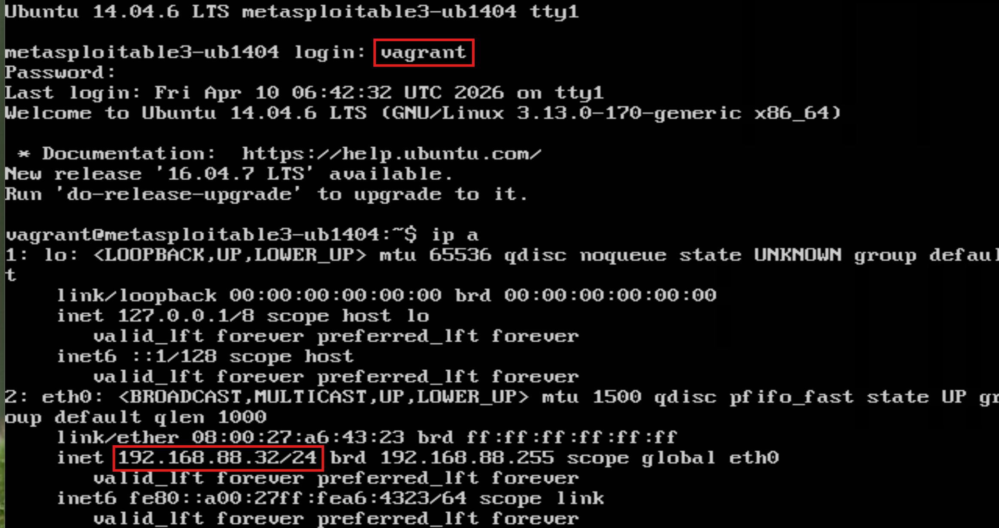

Якщо робити ситуацію більш реальной, то потрібно скористатись **netdiscover** або **nmap**: 
```sh
sudo netdiscover -r 192.168.88.0/24
```
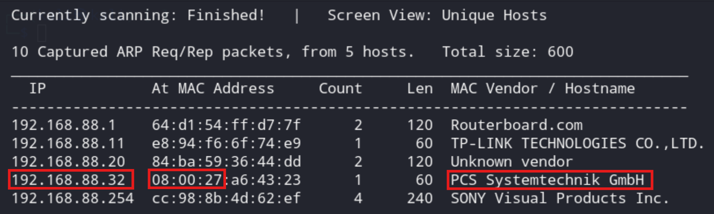

**Увага:** **08:00:27** як частина MAC адреси говорить саме про те, що це ВМ (В моєму випадку запущено лише дві ВМ, одна з яких Калі).

Іноді вартує перевірити доступність цілі (коли ip-адреса відома), це можна зробити звичайним пінгом: 

```bash
ping 192.168.88.32
```
Бачимо, що машинка відповідає:
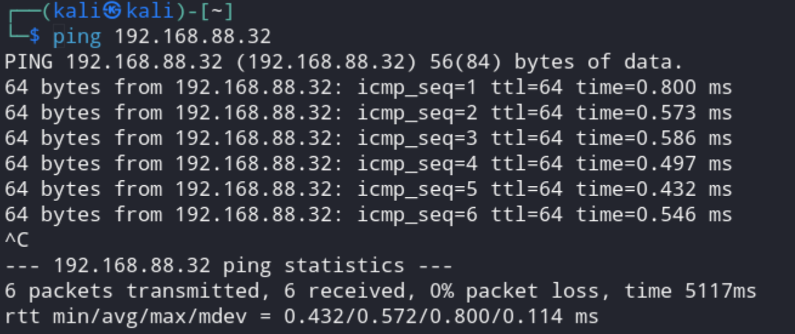

Можемо запускати Metasploit та переходити до більш цікавих справ:


```bash
msfconsole
```
Якщо все йде за планом, отримуємо:

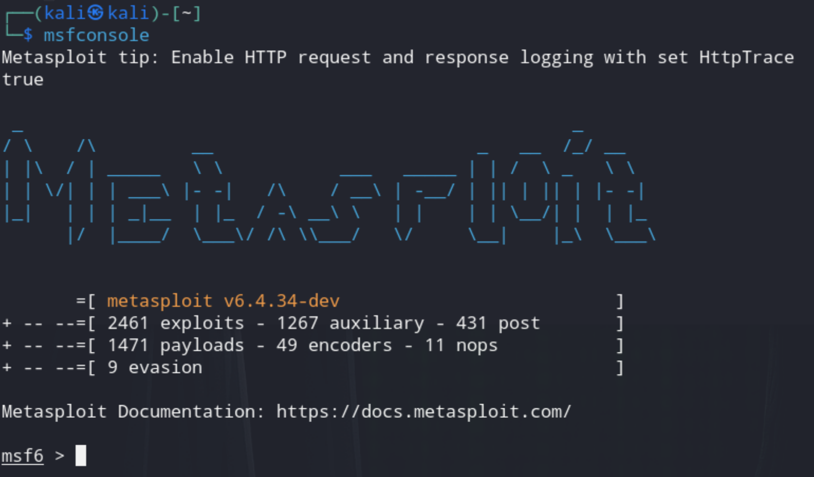

---

--- 

### Крок 2: Базове сканування за допомогою модулів Metasploit

**Модуль:**

```bash
use auxiliary/scanner/portscan/tcp
```
Потім потрібно передивитись налаштування та переконатись, що встановлено IP ADDRESS віддаленого хоста. Потрібні параметри передивляємось за допомогою `show options` Результат буде схожим на наступний скріншот:
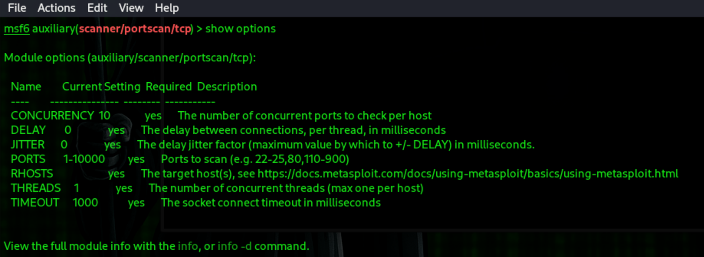


**Налаштування:** в нашому випадку обов'язковим буде саме налаштувати IP ADDRESS віддаленого хоста(-ів) `RHOSTS`.

```bash
set RHOSTS <IP>
set PORTS 1-1000
```
Тобто маємо отримати щось схоже на наступне:
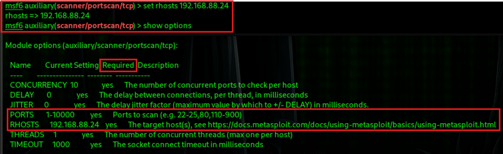

Після цього запускаємо `run` та чекаємо на завершення сканування (в мене зайняло близько 10 хвилин):
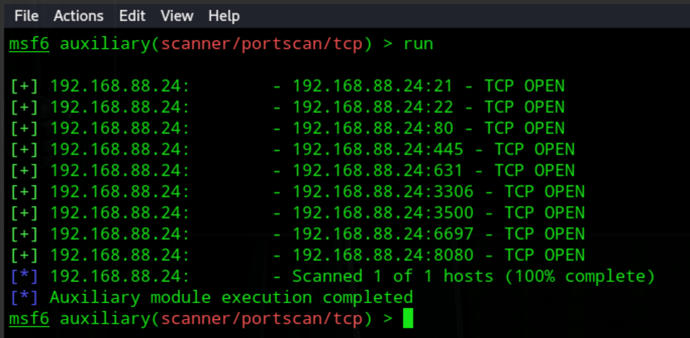

Але після спроби передивитись інформацію про 'хости' отримуємо помилку, тобто цей модуль не записує інформацію про сканування в БД метасплойт:
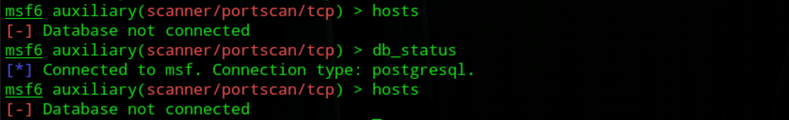

---
---

### Крок 3: Використання інтегрованої команди сканування (обгортки) `db_nmap` 

Відповідно, маємо знайти інше рішення. Варіантів є декілька, але для того, щоб результати сканування гарантовано зберіглись, краще скористатись `db_nmap`.
Виходимо з модуля сканування за допомогою `back`. 

Тобто маємо провести більш спрямований аналіз знайдених портів із збереженням отриманих результатів. Тобто скан-модуль виконав 'брудну' працю і тепер можна запустити `db_nmap` по конкретних портах цільово машини. Виглядати це буде наступним чином:

```sh
db_nmap -sV -p 21,22,80,445,631,3306,3500,6697,8080 192.168.88.24
```
Отримуємо результат:
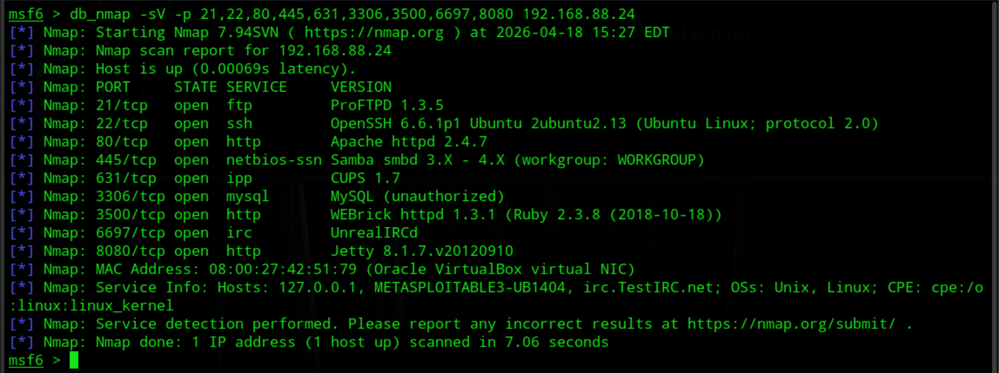 

Результати цього сканування вже зберігаються в `db_msf`:
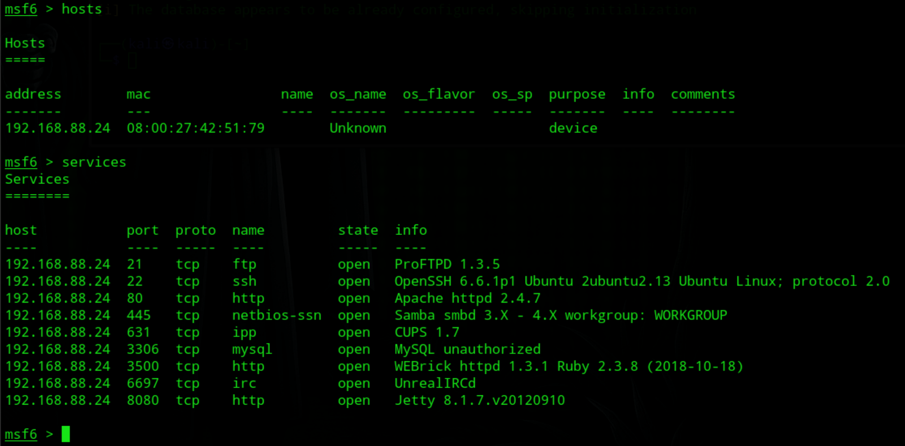

За статистикою [SMB_TOP](SMB_TOP.md) є найкращим кандидатом для подальших досліджень. То як раз з цього й почнемо.

```sh
db_nmap -p445 --script smb-enum*
``` 
Загальний вигляд фрагменту результату виглядає наступним чином:
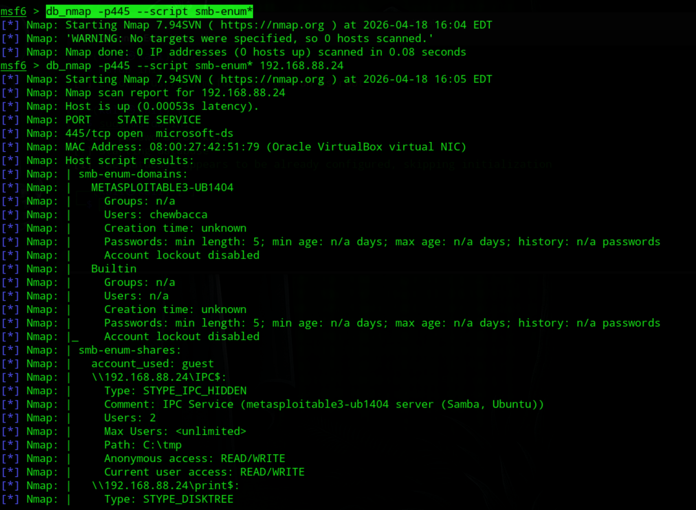

Повний результат міститься у файлі [SMB enumaration results](db_nmap_SMBenum_results.txt) 


---
---


## 3. Пояснення/Узагальнення
**Мета:**

* зрозуміти роботу TCP-сканера
* порівняти з Nmap пізніше

---
### 3.1. Пояснення до практики 2

---

####  Загальна логіка практики

Це **етап Scanning** в моделі:

```text
Recon → Scanning → Enumeration → Exploitation
```

Задача:

* визначити **відкриті порти**
* підготувати базу для подальшої атаки

---

#### 1. Вибір модуля

```bash
use auxiliary/scanner/portscan/tcp
```

---

##### Що це робить

* підключає модуль TCP-сканування
* знаходиться в категорії `auxiliary` (тобто не exploit)

модуль:

* виконує **активне сканування портів**
* перевіряє доступність TCP-сервісів

---

##### Чому обрано саме цей модуль

###### 1. Це базовий рівень

* без складної логіки
* дозволяє зрозуміти принцип

###### 2. Вбудований у Metasploit

* Не потрібно зовнішніх інструментів
* Але за замовчанням НЕ інтегрується з БД MSF

###### 3. Контрольований процес

* Можна побачити:

  * як задаються параметри
  * як працює сканування

---

##### Логіка вибору

```text
Потрібно знайти відкриті порти
→ обираємо scanner
→ обираємо TCP (найпоширеніший протокол)
→ беремо базовий portscan
```

---

#### 2. Встановлення цілі

```bash
set RHOSTS <IP>
```

---

##### Що це

* `RHOSTS` = Remote Hosts
* IP або список IP для сканування

---

##### Чому це важливо

без цього:

* модуль не знає, куди відправляти пакети

---

##### Логіка вибору

```text
Є ціль (Metasploitable)
→ потрібно вказати її IP
→ задаємо RHOSTS
```

---

##### Особливість

* можна:

  * один IP
  * діапазон
  * список

---

#### 3. Вибір портів

```bash
set PORTS 1-10000
```

---

##### Що це

* задає діапазон портів для сканування

---

##### Чому 1–10000

це:

* **well-known ports**

###### приклади:

* 21 → FTP
* 22 → SSH
* 80 → HTTP
* 443 → HTTPS

---

##### Логіка вибору

```text
Хочемо швидко знайти найважливіші сервіси
→ беремо стандартні порти
→ 1–10000 дає баланс швидкість/корисність
```

---

##### Баланс

| Діапазон | Плюси  | Мінуси         |
| -------- | ------ | -------------- |
| 1–10000  | швидко | не всі сервіси |
| 1–65535  | повно  | довго          |

---

#### 4. Паралелізація (для цього модуля не рекомендовано, якщо подивитесь докі)

Але про всяк випадок, як можна змінити:
```bash
set THREADS 10
```

---

##### Що це

* кількість паралельних потоків
* скільки портів перевіряється одночасно

---

##### Чому це важливо

впливає на:

* швидкість
* навантаження
* “шум” у мережі

---

##### Логіка вибору

```text
1 потік → дуже повільно
100 потоків → шумно, може палитись
10 → компроміс
```

---

#####  Поведінка

* більше потоків:

  * швидше
  * менш stealth

* менше потоків:

  * повільніше
  * більш “тихо”

---

#### 5. Запуск

```bash
run
```

---

##### Що це

* запускає модуль з заданими параметрами

---

#####  Що відбувається всередині

1. MSF генерує TCP-запити
2. надсилає їх на ціль
3. аналізує відповіді:

| Відповідь | Висновок       |
| --------- | -------------- |
| SYN-ACK   | порт відкритий |
| RST       | закритий       |
| timeout   | фільтрований   |

---

##### Логіка

```text
Параметри задані
→ запускаємо процес
→ отримуємо результати
```

---

### МЕТА ПРАКТИКИ

---

#### 1. Розуміння TCP-сканування

Зацікавлена особа бачить:

* як відбувається перевірка портів
* як система реагує

---

#### 2. Підготовка до enumeration

після цього:

* можна запускати:

  * smb_version
  * ssh_version
  * ftp_version

---

#### 3. Порівняння з Nmap

---

#### Ключова ідея

### Metasploit:

* інтегрований
* частина attack chain

### Nmap:

* швидший
* глибший аналіз

---

#### Узагальнена логіка вибору

```text
Потрібно знайти сервіси
→ обираємо TCP scan
→ задаємо ціль
→ обмежуємо порти (ефективність)
→ контролюємо швидкість (threads)
→ запускаємо
```


### Приклад: інтеграція з Nmap

```bash
db_nmap -sS -sV <IP>
```

**Результат:**

* дані зберігаються у БД Metasploit

Перевірка:

```bash
hosts
services
```

---

### Приклади сканування сервісів

**Приклад 1: SMB**

```bash
use auxiliary/scanner/smb/smb_version
set RHOSTS <IP>
run
```

**Приклад 2: SSH**

```bash
use auxiliary/scanner/ssh/ssh_version
```

**Приклад 3: FTP**

```bash
use auxiliary/scanner/ftp/ftp_version
```

---

### Приклад пошуку уразливостей

**Модулі:**

```bash
use auxiliary/scanner/vuln/
```

**Приклад:**

```bash
auxiliary/scanner/smb/smb_ms17_010
```

**Мета:**

* співставлення версії сервісу та уразливості
* розуміння зв’язки: CVE → exploit

---

### Приклад автоматизації через workspaces

```bash
workspace -a lab1
workspace lab1
```

Збереження результатів:

```bash
hosts
services
vulns
```

---

### Приклад Pivot-розвідки (базово)

(підготовка до майбутніх модулей)

* робота з кількома хостами
* фільтрація:

```bash
services -p 445
```

---

## 4. Практичні завдання (CTF-логіка)

---

###  Завдання 1

Знайти:

* IP цілі
* всі відкриті порти до 10000

---

###  Завдання 2

Визначити:

* версії сервісів
* ОС (за непрямими ознаками)

---

###  Завдання 3

Знайти:

* мінімум 2 потенційні вразливості

---

###  Завдання 4 (просунутий рівень)

Співставити:

* сервіс → версія → CVE → exploit (у Metasploit)

---

## 4. Важливі акценти: 

---

**Помилка новачків:**

> “Metasploit = інструмент експлуатації”

**Правильно:**

> “Metasploit = платформа для розвідки + експлуатації”

---

**Зв’язка інструментів:**

* Metasploit НЕ заміна Nmap
* Metasploit ЦЕ оркестратор

---

**Логіка атакуючого:**

1. Discovery
2. Enumeration
3. Exploitation

---

## 5. Розширення практичного завдання (за бажанням)

Можна посилити:

* Додати Wireshark
  → аналіз трафіку сканування

* Додати Suricata
  → виявлення сканування

* Додати локальну LLM (ollama+(qwen7b, mistral7b)+openwebui):
  → генерація IDS-правил на основі трафіку

---

## 6. Критерії оцінювання

| Критерій             | Бали |
| -------------------- | ---- |
| Знайдено хости       | 10   |
| Визначено сервіси    | 20   |
| Визначено версії     | 20   |
| Знайдено уразливості | 25   |
| Аналіз і висновки    | 25   |

---