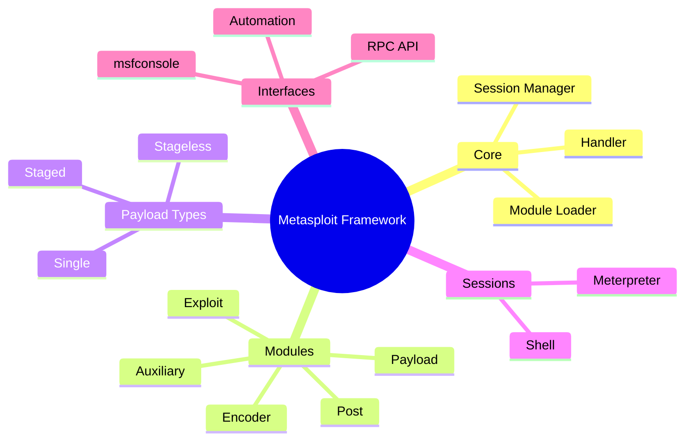
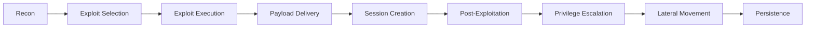
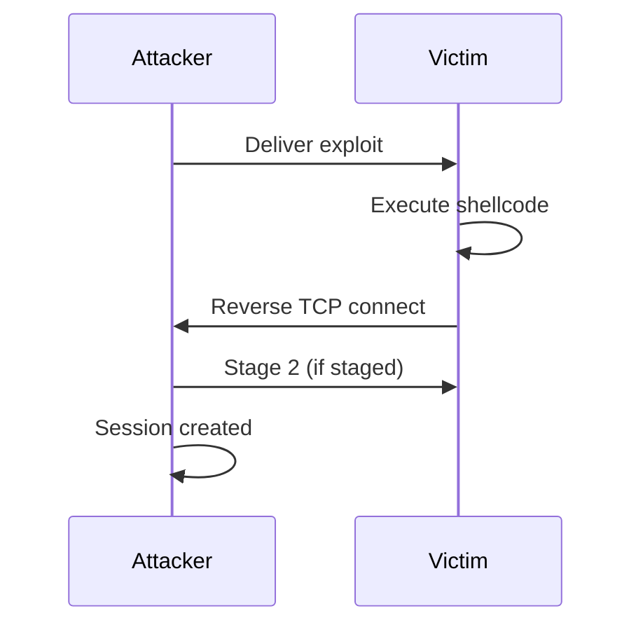
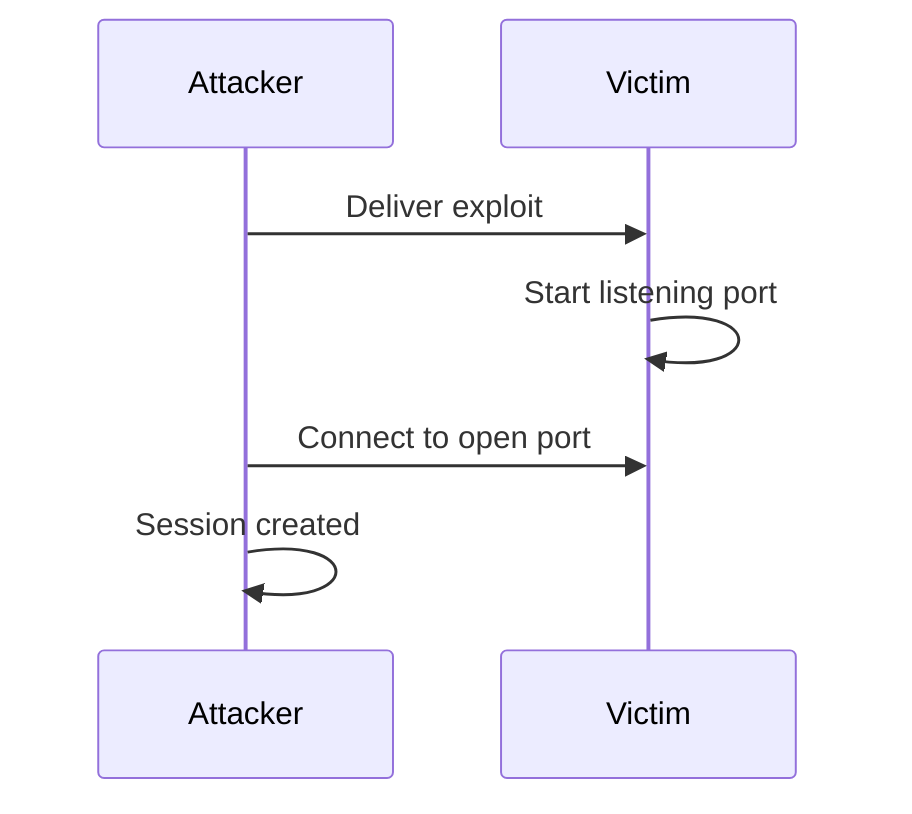
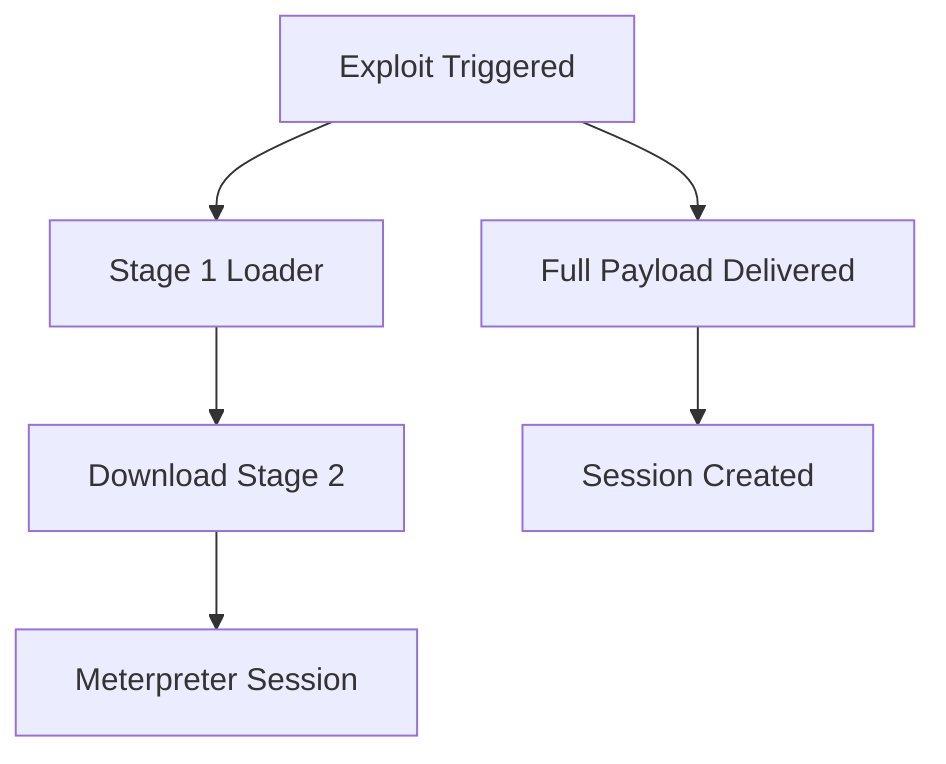
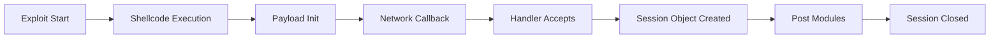
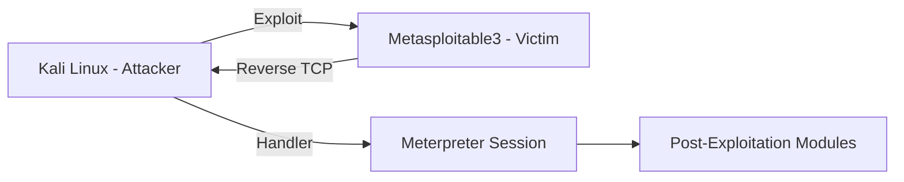

# 1️⃣ Mindmap архітектури Metasploit

---

# 2️⃣ Логічна модель атаки (зв’язок із Kill Chain)

---

# 3️⃣ Reverse TCP — мережева взаємодія attacker ↔ victim

---

# 4️⃣ Bind TCP — мережева взаємодія

---

# 5️⃣ Staged vs Stageless Payload

---

# 6️⃣ Життєвий цикл сесії

---

# 7️⃣ Архітектурна взаємодія в лабораторії

---

# Як користуватись

Логіка наступна:

1. Спочатку розібрати архітекруту **Metasploit**
2. Потім з'ясувати/згадати як відбувається **Reverse TCP sequence**
3. Далі узагальнення у вигляді **Lifecycle**
4. **Бажано**, після практики  — повернутись та передивитсь діаграми

Така послідовність спрямована на формування **замкненого когнітивного циклу навчання**.

